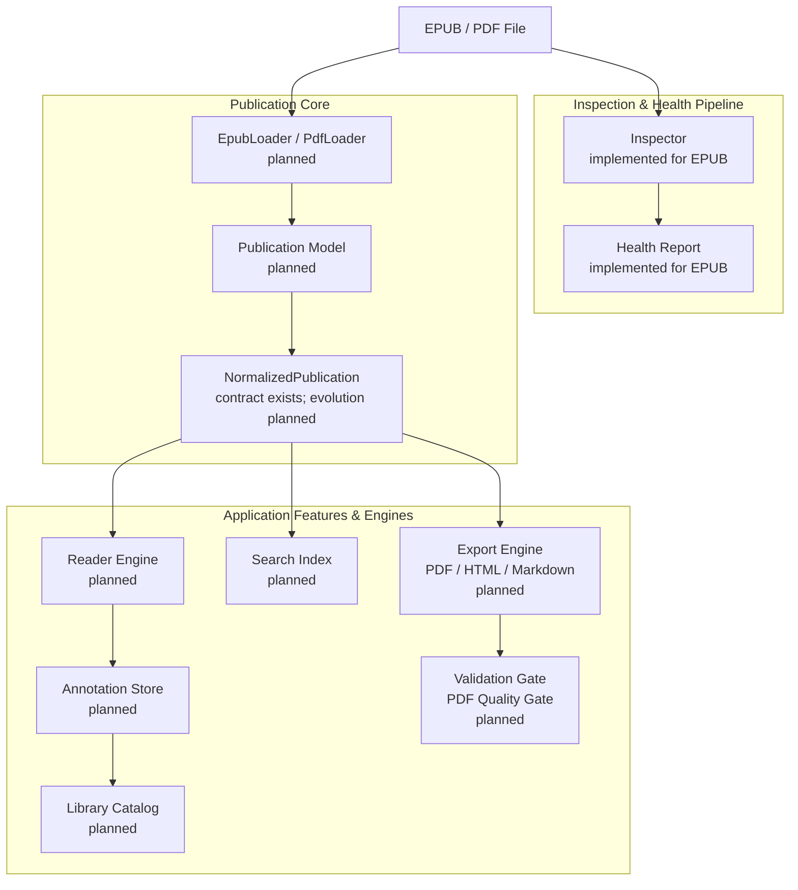

# ReflowPress

> **A free, local-first workbench for reading, organizing, inspecting, repairing, searching, annotating, and exporting EPUB and PDF publications.**

_EPUB/PDFを読む・整理する・検索する・注釈する・検査する・修復する・変換するための、無料・ローカルファースト電子書籍ワークベンチ。_

ReflowPress bridges document reading, library organization, publication health inspection, safe repair, and high-fidelity document conversion into an integrated, offline-first personal electronic book environment.

---

## Current Status & Implementation Facts

> [!IMPORTANT]
> **ReflowPress is in active foundation development.**
> Do not mistake planned functionality for implemented features. The desktop reader GUI, PDF conversion, library management, and repair tools are **planned for future milestones**.

### Current State (`main`)

- **Milestone 0.1 (Foundation)**: **Complete**
- **EPUB Inspector (`inspectEpub`)**: **Implemented** (Parses ZIP container, `container.xml`, and OPF package document; extracts metadata, manifest, and spine; enforces path safety and resource limits; backed by 22 passing unit tests).
- **Publication Core Contracts**: **Type-level contracts defined** (`NormalizedPublication`, `PublicationAdapter`, `Renderer`, `PdfValidator`).
- **Publication Core Implementation (`EpubLoader`)**: **Next (Milestone 0.2)**.
- **Reader Engine & Viewer UI**: **Planned (Milestone 0.3)**.
- **Library Catalog & Collections**: **Planned (Milestone 0.4)**.
- **Reading Tools (Search, Notes, Annotations)**: **Planned (Milestone 0.5)**.
- **Japanese Typography & Accessibility**: **Planned (Milestone 0.6)**.
- **Export Workbench (EPUB to PDF/HTML/MD)**: **Planned (Milestone 0.7)**.
- **Publication Repair & PDF Quality Gate**: **Planned (Milestone 0.8)**.

---

## Architecture v2

ReflowPress shares one single **Publication Core** between document reading and document export, preventing duplicate parsing logic.



See the [Architecture v2 Document](docs/architecture.md) and [Diagram Notes](docs/diagrams/README.md) for full subsystem details.

---

## Using the EPUB Inspector (Implemented)

The programmatic API in `@reflowpress/epub` can inspect any local EPUB archive today:

```ts
import { inspectEpub } from "@reflowpress/epub";

const inspection = await inspectEpub("./book.epub");

console.log("Package Path:", inspection.packagePath);
console.log("Title:", inspection.metadata.title);
console.log("Manifest Items:", inspection.manifest.length);
console.log("Spine Itemrefs:", inspection.spine.length);
```

The inspector evaluates archive validity, verifies internal OPF references, checks that manifest resources exist in the archive, and enforces configurable safety caps (archive bytes, entry counts, XML document limits) without extracting files to disk.

---

## Product Principles

1. **Free and open source**: Licensed openly and community-auditable.
2. **Local-first**: Books, catalogs, notes, and indexes stay on your local disk.
3. **Account optional**: No mandatory sign-in, cloud accounts, or subscriptions.
4. **Standards-first**: Compliant with EPUB 2/3, PDF (ISO 32000), HTML5, and CSS standards.
5. **No DRM circumvention**: We respect legal boundaries; DRM files are safely detected, explained, and treated as unsupported.
6. **Reader and converter share one Publication Core**: Unified data model eliminates duplicate parsers.
7. **Never silently corrupt a publication**: Malformed input is surfaced transparently.
8. **Inspect before repair**: Factual diagnostics always precede remediation.
9. **Non-destructive edits by default**: Original books remain untouched; repairs and exports generate separate files.
10. **Automated repairs must be explainable and reversible**: Every repair diff is previewable and undoable.
11. **Quality is a product feature**: Built-in verification gates guarantee document fidelity.
12. **AI is optional**: 100% usable in offline, air-gapped environments without AI.
13. **Privacy by default**: Zero telemetry, zero analytics tracking, zero silent network calls.
14. **Accessibility is a first-class requirement**: Keyboard navigation, ARIA semantics, and contrast ratios are core design requirements.

Read the complete [Product Vision](docs/product-vision.md) and [ADE Compatibility Matrix](docs/compatibility-matrix.md).

---

## Roadmap v2

| Milestone                | Scope                                                                         | Status       |
| ------------------------ | ----------------------------------------------------------------------------- | ------------ |
| **0.1 Foundation**       | Monorepo, contracts, CI, and Phase 1 EPUB Inspector                           | **Complete** |
| **0.2 Publication Core** | EPUB Loader, resources, reading order, navigation, normalization              | **Next**     |
| **0.3 Reader MVP**       | Reflowable EPUB rendering, PDF viewing, TOC, reading position, themes         | Planned      |
| **0.4 Library MVP**      | Local directory scan, covers, metadata catalog, collections, sorting          | Planned      |
| **0.5 Reading Tools**    | In-book search, bookmarks, highlights, notes, portable annotation export      | Planned      |
| **0.6 Japanese & A11y**  | Vertical Japanese (`vertical-rl`), ruby, kinsoku, keyboard nav, screen-reader | Planned      |
| **0.7 Export Workbench** | EPUB to PDF (timestamp naming), HTML, Markdown, batch CLI                     | Planned      |
| **0.8 Quality & Repair** | Diagnostic health suite, non-destructive safe repair, PDF Quality Gate        | Planned      |
| **0.9 Interoperability** | OPDS catalog support, e-reader device transfer, local cloud sync              | Planned      |
| **1.0 Stable Release**   | Native installers, crash recovery, performance optimization, API freeze       | Planned      |

Read the full milestone descriptions in [docs/roadmap.md](docs/roadmap.md).

---

## Development Setup

Requires Node.js >= 22.13.0 and pnpm >= 11.25.0:

```sh
pnpm install
pnpm lint
pnpm typecheck
pnpm test
pnpm build
```

---

## Architecture Decision Records

- [ADR 0001: Layered Publication Pipeline](docs/adr/0001-layered-publication-pipeline.md)
- [ADR 0002: Product Reboot to Local-First Ebook Workbench](docs/adr/0002-product-reboot-workbench.md)
