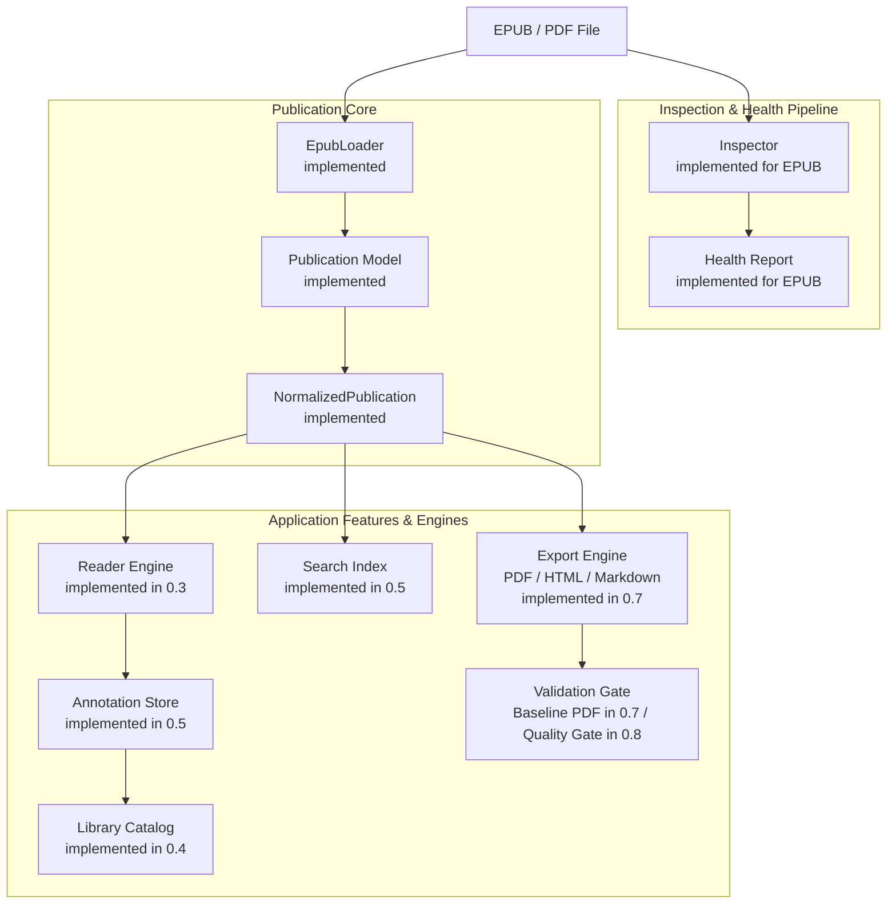

# ReflowPress

> **A free, local-first workbench for reading, organizing, inspecting, repairing, searching, annotating, and exporting EPUB and PDF publications.**

_EPUB/PDFを読む・整理する・検索する・注釈する・検査する・修復する・変換するための、無料・ローカルファースト電子書籍ワークベンチ。_

ReflowPress bridges document reading, library organization, publication health inspection, safe repair, and high-fidelity document conversion into an integrated, offline-first personal electronic book environment.

---

## Current Status & Implementation Facts

> [!IMPORTANT]
> **ReflowPress Milestone 0.8 — Quality & Repair is Complete.**
> The desktop reader GUI (0.3), Library catalog (0.4), Reading Tools (0.5), Japanese Typography & Accessibility (0.6), Export Workbench (0.7), and Quality Diagnostic Suite with Safe Repair (0.8) are **implemented**. Interoperability features (Milestone 0.9) are planned.

### Current State (`main`)

- **Milestone 0.1 (Foundation)**: **Complete**
- **Milestone 0.2 (Publication Core)**: **Complete** (Implements `EpubLoader` & `loadEpub`, shared archive parser, EPUB 2/3 navigation normalization, safe XHTML content extraction, auxiliary resources loading, resource boundaries, and DRM detection; verified by 36 unit tests).
- **Milestone 0.3 (Reader MVP)**: **Complete** (Implements `@reflowpress/reader` and `@reflowpress/desktop` application shell with Electron 33, React 19, Vite, PDF.js, reflowable EPUB iframe isolation, XHTML sanitizer, native PDF viewing, TOC drawer, keyboard/page stepping, Light/Dark/Sepia themes, typography controls, atomic reading position persistence, and Playwright desktop E2E tests).
- **Milestone 0.4 (Library MVP)**: **Complete** (Implements `@reflowpress/library` domain package, recursive local directory scanner with incremental indexing, versioned atomic JSON catalog persistence with corrupt file quarantine, EPUB cover extraction and caching, Grid/List catalog views, multi-field search, collection/shelf organization, and Playwright desktop E2E tests).
- **Milestone 0.5 (Reading Tools)**: **Complete** (Implements `@reflowpress/annotations` domain package, `@reflowpress/search` in-book search engine for EPUB and PDF, W3C Web Annotation compliant hybrid locators, multi-color text highlights, bookmarks, margin notes, versioned atomic JSON annotation persistence with corrupt quarantine, portable Markdown/HTML/JSON export and import, drawer UI, floating selection toolbar, hotkeys, and Playwright desktop E2E tests).
- **Milestone 0.6 (Japanese Typography & Accessibility)**: **Complete** (Implements `@reflowpress/typography` domain package, Chromium standards-based CSS Writing Modes (`vertical-rl`), strict kinsoku line breaking, native `<ruby>` presentation, Tate-chu-yoko numeral alignment with non-destructive auto-assist, axis-aware keyboard and column progression, WCAG 2.2 AA accessibility baseline with full keyboard focus management, focus trap and restoration for dialogs, polite ARIA live announcements, high contrast and forced-colors support, reduced motion preferences, automated axe-core accessibility regression testing, and Playwright desktop E2E tests).
- **Milestone 0.7 (Export Workbench)**: **Complete** (Implements `@reflowpress/export`, `@reflowpress/cli`, ADR 0007 Playwright Chromium headless rendering with strict network offline isolation, standalone HTML export with Data URL asset inlining, GFM Markdown export with YAML frontmatter and ruby `base（reading）` transliteration, deterministic timestamp naming `<stem>_<YYYYMMDD-HHmmss>.<ext>`, collision resolution `-001`..`-999`, transactional atomic writing, bounded concurrency batch exporting, headless CLI `reflowpress export`, and Playwright CLI E2E tests).
- **Milestone 0.8 (Quality & Repair)**: **Complete** (Implements `@reflowpress/quality` diagnostic rule engine for EPUB and PDF, stable rule catalog `EPUB-*` and `PDF-*`, deterministic sorting and deduplication, PDF Quality Gate evaluation profiles `baseline` and `reader-export`, `@reflowpress/repair` safe non-destructive repair engine with canonical uncompressed mimetype rewriting, manifest media-type correction, standard `container.xml` creation, transactional staging with pre/post re-inspection verification, `.provenance.json` sidecar generation, headless CLI subcommands `reflowpress inspect`, `validate`, `repair`, Desktop Health & Safe Repair modal with WCAG 2.2 accessibility, 3-Tier Golden Master regression framework, 167 unit tests, and 26 Playwright E2E tests).
- **Publication Core (`loadEpub`, `EpubLoader`)**: **Implemented** (`NormalizedPublication` model, reading order, navigation hierarchy, metadata, auxiliary assets).
- **Desktop Reader MVP**: **Implemented** (EPUB/PDF viewing, TOC, reading positions, themes, typography settings).
- **Library Catalog & Collections**: **Implemented** (Recursive scanning, cover cache, collections, shelves, search, tags).
- **Reading Tools (Search, Notes, Annotations)**: **Implemented** (In-book search, bookmarks, highlights, notes, portable PKM export/import).
- **Japanese Typography & Accessibility**: **Implemented (Milestone 0.6)**.
- **Export Workbench (EPUB to PDF/HTML/MD & Headless CLI)**: **Implemented (Milestone 0.7)**.
- **Quality Diagnostic Suite & Safe Repair**: **Implemented (Milestone 0.8)**.
- **Interoperability (OPDS, Cloud Sync, Device Transfer)**: **Next (Milestone 0.9)**.

---

## Architecture v2

ReflowPress shares one single **Publication Core** between document reading and document export, preventing duplicate parsing logic.



See the [Architecture v2 Document](docs/architecture.md) and [Diagram Notes](docs/diagrams/README.md) for full subsystem details.

---

## Programmatic API

### Loading Publications (`loadEpub`) (Implemented in 0.2)

```ts
import { loadEpub } from "@reflowpress/epub";

const publication = await loadEpub("./book.epub");

console.log("Title:", publication.metadata.title);
console.log("Version:", publication.version);
console.log("Chapters:", publication.readingOrder.length);
console.log("TOC Items:", publication.navigation?.length);
console.log("Assets:", publication.resources.length);
```

### Inspecting EPUB Structure (`inspectEpub`) (Implemented in 0.1)

```ts
import { inspectEpub } from "@reflowpress/epub";

const inspection = await inspectEpub("./book.epub");

console.log("Package Path:", inspection.packagePath);
console.log("Title:", inspection.metadata.title);
console.log("Manifest Items:", inspection.manifest.length);
console.log("Spine Itemrefs:", inspection.spine.length);
```

The inspector evaluates archive validity, verifies internal OPF references, checks that manifest resources exist in the archive, and enforces configurable safety caps (archive bytes, entry counts, XML document limits) without extracting files to disk.

---

## Product Principles

1. **Free and open source**: Licensed openly and community-auditable.
2. **Local-first**: Books, catalogs, notes, and indexes stay on your local disk.
3. **Account optional**: No mandatory sign-in, cloud accounts, or subscriptions.
4. **Standards-first**: Compliant with EPUB 2/3, PDF (ISO 32000), HTML5, and CSS standards.
5. **No DRM circumvention**: We respect legal boundaries; DRM files are safely detected, explained, and treated as unsupported.
6. **Reader and converter share one Publication Core**: Unified data model eliminates duplicate parsers.
7. **Never silently corrupt a publication**: Malformed input is surfaced transparently.
8. **Inspect before repair**: Factual diagnostics always precede remediation.
9. **Non-destructive edits by default**: Original books remain untouched; repairs and exports generate separate files.
10. **Automated repairs must be explainable and reversible**: Every repair diff is previewable and undoable.
11. **Quality is a product feature**: Built-in verification gates guarantee document fidelity.
12. **AI is optional**: 100% usable in offline, air-gapped environments without AI.
13. **Privacy by default**: Zero telemetry, zero analytics tracking, zero silent network calls.
14. **Accessibility is a first-class requirement**: Keyboard navigation, ARIA semantics, and contrast ratios are core design requirements.

Read the complete [Product Vision](docs/product-vision.md) and [ADE Compatibility Matrix](docs/compatibility-matrix.md).

---

## Roadmap v2

| Milestone                | Scope                                                                         | Status       |
| ------------------------ | ----------------------------------------------------------------------------- | ------------ |
| **0.1 Foundation**       | Monorepo, contracts, CI, and Phase 1 EPUB Inspector                           | **Complete** |
| **0.2 Publication Core** | EPUB Loader, resources, reading order, navigation, normalization              | **Complete** |
| **0.3 Reader MVP**       | Reflowable EPUB rendering, PDF viewing, TOC, reading position, themes         | **Complete** |
| **0.4 Library MVP**      | Local directory scan, covers, metadata catalog, collections, sorting          | **Complete** |
| **0.5 Reading Tools**    | In-book search, bookmarks, highlights, notes, portable annotation export      | **Complete** |
| **0.6 Japanese & A11y**  | Vertical Japanese (`vertical-rl`), ruby, kinsoku, keyboard nav, screen-reader | **Complete** |
| **0.7 Export Workbench** | EPUB to PDF (timestamp naming), HTML, Markdown, batch CLI                     | **Complete** |
| **0.8 Quality & Repair** | Diagnostic health suite, non-destructive safe repair, PDF Quality Gate        | **Next**     |
| **0.9 Interoperability** | OPDS catalog support, e-reader device transfer, local cloud sync              | Planned      |
| **1.0 Stable Release**   | Native installers, crash recovery, performance optimization, API freeze       | Planned      |

Read the full milestone descriptions in [docs/roadmap.md](docs/roadmap.md).

---

## Headless CLI & Export Workbench

ReflowPress provides a headless CLI (`reflowpress`) for offline, automated publication conversions:

```sh
# Export an EPUB to PDF (default format)
node apps/cli/dist/cli.js export book.epub --format pdf --output-dir ./dist

# Export with Japanese vertical layout and B5 page size
node apps/cli/dist/cli.js export novel.epub --format pdf --writing-mode vertical-rl --page-size B5

# Batch export all publications in a folder to PDF, HTML, and Markdown
node apps/cli/dist/cli.js export ./library --recursive --format all --jobs 4 --output-dir ./exports

# Output machine-readable JSON summary to stdout
node apps/cli/dist/cli.js export book.epub --format markdown --json
```

---

## Running the Desktop Workbench

Build the monorepo and launch the Electron application:

```sh
pnpm install
pnpm build
npx electron apps/desktop/dist/main/main.js
```

Or open a book directly:

```sh
npx electron apps/desktop/dist/main/main.js --open path/to/book.epub
```

---

## Development Setup

Requires Node.js >= 22.13.0 and pnpm >= 11.25.0:

```sh
pnpm install
pnpm lint
pnpm typecheck
pnpm test
pnpm test:cli
pnpm build
pnpm test:e2e
```

---

## Architecture Decision Records

- [ADR 0001: Layered Publication Pipeline](docs/adr/0001-layered-publication-pipeline.md)
- [ADR 0002: Product Reboot to Local-First Ebook Workbench](docs/adr/0002-product-reboot-workbench.md)
- [ADR 0003: Desktop Reader Runtime (Electron + React + Vite + PDF.js)](docs/adr/0003-desktop-reader-runtime.md)
- [ADR 0004: Library Persistence Architecture and Repository Abstraction](docs/adr/0004-library-persistence.md)
- [ADR 0005: Annotation Locators, Selectors, and Storage Architecture](docs/adr/0005-annotation-locators-and-storage.md)
- [ADR 0006: Japanese Typography and Accessibility Architecture](docs/adr/0006-japanese-typography-and-accessibility.md)
- [ADR 0007: Export Rendering Pipeline (Playwright Chromium Headless)](docs/adr/0007-export-rendering-pipeline.md)
