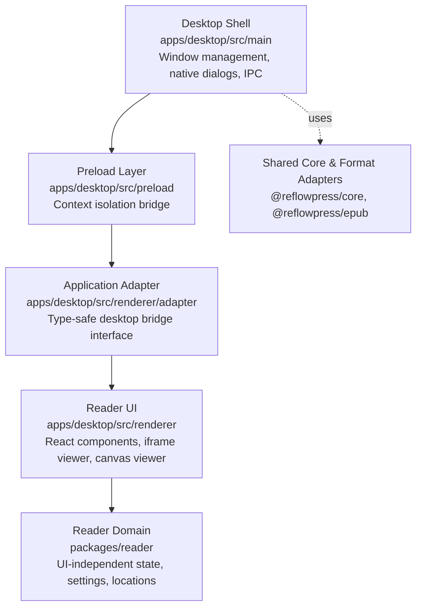

# ADR 0003: Desktop Reader Runtime Architecture

- Status: Accepted for Milestone 0.3
- Date: 2026-10-02
- Context & Precedents: Builds on [ADR 0001](0001-layered-publication-pipeline.md) and [ADR 0002](0002-product-reboot-workbench.md).

## Context

Milestone 0.3 marks the transition of ReflowPress from a headless parsing foundation into an interactive electronic document workbench. The core requirement of this milestone is to deliver a reliable, accessible, local-first reader capable of opening, rendering, navigating, and styling DRM-free EPUB and PDF publications on desktop platforms (Windows, macOS, Linux).

To deliver this GUI, we must select an application runtime shell.

## Options Considered

### 1. Electron (Chromium + Node.js)

- **Strengths**:
  - **Identical Rendering Engine Across Platforms**: Bundles a pinned Chromium release, guaranteeing that EPUB CSS layout, CSS Paged Media constructs, and font metrics behave identically across Windows, macOS, and Linux without OS WebView discrepancies.
  - **Full TypeScript/Node Monorepo Compatibility**: Seamlessly integrates with the existing pnpm workspace, shared TypeScript packages (`@reflowpress/core`, `@reflowpress/epub`), and Node-based file operations.
  - **PDF.js Compatibility**: Mozilla PDF.js operates with maximum stability and performance on modern Chromium canvas/worker pipelines.
  - **E2E Automation**: Playwright provides first-class, official out-of-the-box support for Electron (`playwright._electron.launch`), enabling automated integration tests.
  - **Future Japanese Typography Readiness**: Chromium maintains industry-leading implementations of CSS Writing Modes level 3 (`vertical-rl`), ruby annotations (`<ruby>`, `<rt>`), and line-breaking constraints (kinsoku), which are central to ReflowPress's roadmap (Milestone 0.6).
- **Weaknesses**:
  - Higher memory footprint and larger distribution bundle size (approx. 80-120 MB installer) compared to native webview runtimes.

### 2. Tauri (Rust + System WebView)

- **Strengths**:
  - Extremely compact binary size and lower idle memory consumption.
  - Fast startup time.
- **Weaknesses**:
  - **OS WebView Fragmentation**: Relies on WebKit (Safari) on macOS, WebView2 (Edge/Chromium) on Windows, and WebKitGTK on Linux. Subtle differences in CSS writing modes, font fallback, iframe sandboxing, and canvas rendering undermine publication layout consistency.
  - **Dual Toolchain Complexity**: Introduces a required Rust compiler, Cargo toolchain, and OS-specific C libraries, substantially raising CI build times and onboarding overhead for a TypeScript-first project.
  - **E2E Automation Friction**: Automated testing of Tauri applications via Playwright or WebDriver requires complex native driver setups compared to Electron's native Playwright integration.

### 3. Browser / PWA Only (Web App with File System Access API)

- **Strengths**:
  - Zero desktop installation friction; runs directly in user browsers.
- **Weaknesses**:
  - **File System Access Limitations**: The File System Access API is not uniformly supported across all browsers (notably limited in Firefox and Safari), breaking seamless local-first file opening and background state persistence.
  - **Security Sandboxing Restrictions**: PWA storage quotas and origin-isolated storage make persistent local multi-gigabyte library indexing and native file dialog integration brittle.
  - **Offline Longevity**: Browser cache eviction rules can purge offline service worker state without user consent.

## Evaluation Matrix

| Criterion                               | Electron                               | Tauri                           | Browser / PWA                 |
| --------------------------------------- | -------------------------------------- | ------------------------------- | ----------------------------- |
| **TypeScript / Node Workspace Fit**     | **Excellent**                          | Moderate (Requires Rust bridge) | High                          |
| **Rendering Consistency (CSS / Fonts)** | **Excellent (Pinned Chromium)**        | Poor (OS WebView variance)      | Moderate (Browser dependent)  |
| **PDF.js Integration & Workers**        | **Excellent**                          | Good                            | Good                          |
| **Playwright E2E Automation**           | **Excellent (Native `_electron`)**     | Complex (WebDriver required)    | Good                          |
| **Local File Access & Persistence**     | **Excellent (Direct Node IPC)**        | Good (Rust IPC)                 | Limited / Inconsistent        |
| **Security Isolation Controls**         | **High (`contextIsolation`, sandbox)** | High (IPC capabilities)         | Moderate (Web origin sandbox) |
| **Japanese Typography Consistency**     | **Excellent**                          | Variable across platforms       | Variable across browsers      |
| **Bundle Size & Memory**                | Moderate / Heavy (~90MB)               | **Lightweight (~15MB)**         | **Zero install**              |
| **Offline Reliability**                 | **100% Guaranteed**                    | 100% Guaranteed                 | Subject to cache eviction     |

## Decision

We adopt **Electron + React + Vite** as the desktop application shell for Milestone 0.3.

To prevent vendor lock-in and keep future options open (including a future Tauri shell evaluation once rendering standards stabilize), we enforce a strict architectural boundary:

### Key Architectural Safeguards:

1. **Isolated Shell**: Electron-specific APIs (`BrowserWindow`, `ipcMain`, `dialog`) are confined strictly to `apps/desktop/src/main`.
2. **Context Isolation & Security**: `contextIsolation = true`, `nodeIntegration = false`, and `sandbox = true` are enforced. The renderer never accesses Node globals (`fs`, `child_process`, `process`).
3. **Domain Independence**: All reading state machines, setting clamps, navigation calculations, and location tracking live in `@reflowpress/reader` as pure TypeScript logic, completely independent of Electron or React.
4. **Publication Core Unbroken**: Electron processes do **not** re-parse EPUB ZIP archives directly; they invoke the shared `loadEpub()` pipeline from `@reflowpress/epub` to produce the standard `NormalizedPublication`.

## Consequences

### Positive

- Unified rendering engine ensures zero cross-platform rendering regressions for reflowable EPUB layout, vertical text, and PDF canvas drawing.
- Fast development velocity by leveraging the existing Vite / React / TypeScript toolchain.
- Playwright E2E suite can immediately test the full desktop application lifecycle in CI.

### Negative / Trade-offs

- Installer download size is larger than Tauri (~90MB vs ~15MB).
- Memory consumption will be higher, requiring strict resource cleanup (e.g. `URL.revokeObjectURL()` and PDF worker termination) to prevent memory bloat during long reading sessions.
