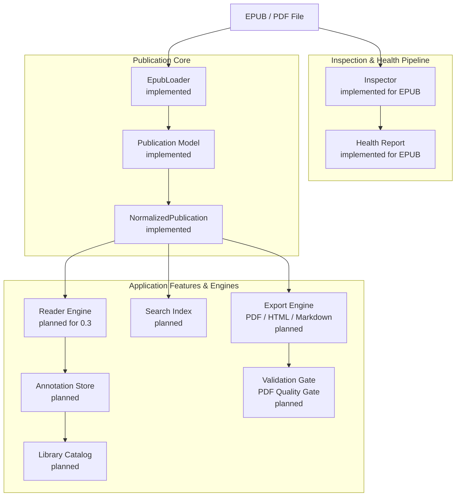
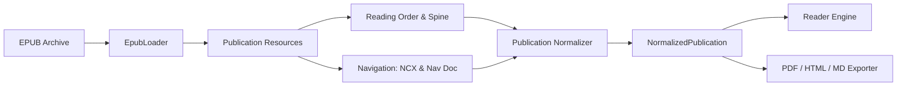
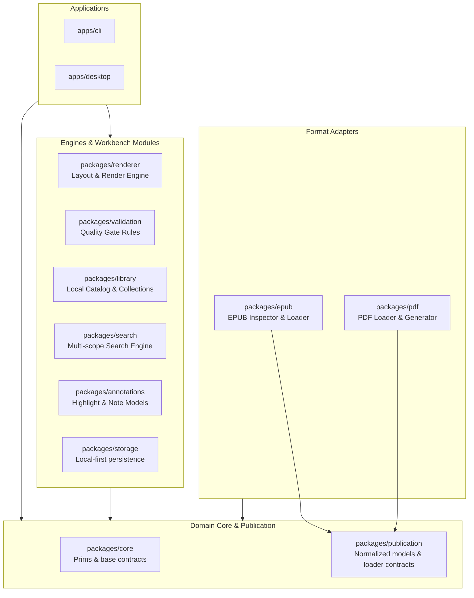
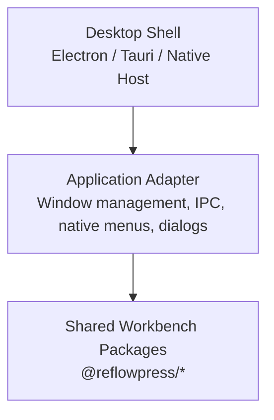

# Architecture v2: Electronic Publication Workbench

This document describes the system architecture for ReflowPress as a free, local-first electronic document workbench.

ReflowPress builds upon the foundational contracts established in Phase 1, expanding them to power both active document reading and high-fidelity document transformation without duplicating publication parsers.

---

## Architecture v2 Overview



### Component Responsibilities

1. **Inspector**: Performs fast, safe structural checks directly on the container archive without extracting full content. Produces the `Health Report`.
2. **Health Report**: Diagnostic details on container validity, package integrity, broken references, missing assets, and typography caveats.
3. **Loader (`EpubLoader`)**: Securely reads archive contents, decrypts standard non-DRM resources (e.g. font deobfuscation if applicable), and extracts publication assets into memory/streams.
4. **NormalizedPublication**: The format-neutral, canonical representation of a book, including its reading order, navigation hierarchy, metadata, and asset map.
5. **Reader**: Coordinates layout, visual paging, typography settings, and user interaction for reflowable and fixed-layout media.
6. **Annotation & Library**: Manages user-generated reading markers (bookmarks, highlights, notes) and collection catalogs stored in local-first storage.
7. **Search Index**: Constructs indexed or runtime full-text search across chapters, publications, and annotations.
8. **Export Engine**: Converts the normalized publication into PDF (via CSS Paged Media rendering), clean HTML, or Markdown.
9. **Validation Gate**: Asserts that generated outputs meet strict quality requirements before being marked as successful.

---

## Publication Core

A foundational principle of Architecture v2 is:

> **The Reader and the Exporter share one Publication Core.**
> An EPUB reader and a PDF export engine must not implement separate, diverging EPUB parsers.

### The Unified Publication Pipeline



### Milestone 0.2 Implementation: Enhanced `NormalizedPublication` Contract

In Milestone 0.2, the publication model was enhanced in `@reflowpress/core` without breaking backward compatibility:

```ts
export interface NavigationItem {
  readonly id?: string;
  readonly label: string;
  readonly href: string;
  readonly children?: readonly NavigationItem[];
}

export interface PublicationMetadata {
  readonly title?: string;
  readonly language?: string;
  readonly identifier?: string;
  readonly creator?: string | readonly string[];
  readonly publisher?: string;
  readonly description?: string;
  readonly rights?: string;
  readonly modified?: string;
  readonly renditionLayout?: "reflowable" | "pre-paginated";
  readonly renditionOrientation?: "auto" | "portrait" | "landscape";
  readonly renditionSpread?: "auto" | "none" | "landscape" | "both";
  readonly direction?: "ltr" | "rtl" | "default";
}

export interface PublicationSection {
  readonly id: string;
  readonly href: string;
  readonly mediaType: string;
  readonly markup: string;
  readonly linear?: boolean;
}

export interface NormalizedPublication {
  readonly version?: "2.0" | "3.0" | string;
  readonly metadata: PublicationMetadata;
  readonly readingOrder: readonly PublicationSection[];
  readonly resources: readonly PublicationResource[];
  readonly navigation?: readonly NavigationItem[];
}
```

### Shared Parsing Primitives (One Parser Path)

`packages/epub` avoids duplicating archive reading and XML/OPF parsing across `inspectEpub` and `EpubLoader`. The shared primitives are:

- `archive.ts`: Streaming ZIP archive access via `yauzl`, CRC32 validation, entry name safety checks, and strict byte limits.
- `xml.ts`: Non-DTD XML document parsing with `@xmldom/xmldom` and direct element traversal helpers.
- `path.ts`: Pure archive-relative path resolution with directory traversal prevention.
- `package-document.ts`: Unified OPF parsing for EPUB 2/3 metadata, manifest item resolution, spine reading order, and navigation document references.
- `navigation.ts`: Unified normalization of EPUB 3 Navigation Document (`<nav epub:type="toc">`) and EPUB 2 NCX (`<navMap> <navPoint>`).

---

## Package Architecture Proposal

### Current Package Structure (Phase 1 Baseline)

```text
packages/
  core/        - Shared format-neutral contracts
  epub/        - EPUB Inspector (implemented), adapter contracts (planned)
  pdf/         - PDF output contract types
  renderer/    - Renderer interface contracts
  validation/  - PDF validator interface contracts
apps/
  cli/         - Command-line entry point (placeholder)
```

### Future Package Architecture Proposal

As ReflowPress grows toward Milestone 1.0, responsibilities will be partitioned into focused, single-purpose packages to avoid turning `core` into an unwieldy monolith:



### Proposed Package Responsibilities

- `@reflowpress/core`: Primitive types, error classification, common utilities, and system abstractions. Kept ultra-light.
- `@reflowpress/publication`: Definition of `NormalizedPublication`, section hierarchies, resource trees, and loader abstractions.
- `@reflowpress/epub`: EPUB Inspector, EPUB 2/3 Loader, resource unpacker, and safe repair mechanics.
- `@reflowpress/pdf`: PDF document abstraction, PDF rendering target, and PDF parser.
- `@reflowpress/renderer`: Presentation engine abstractions, CSS layout processing, pagination math.
- `@reflowpress/validation`: Rules engine for EPUB diagnostic checks and PDF Quality Gate assertions.
- `@reflowpress/library`: SQLite/file-based book indexing, cover generation, collections, and shelf queries.
- `@reflowpress/search`: Inverted index and streaming search across publications and notes.
- `@reflowpress/annotations`: Highlight anchoring (EPUB CFI / text selectors), notes, bookmark models, and export serializers.
- `@reflowpress/storage`: Local filesystem abstraction, atomic file writing, backup rotation, and platform-specific path helpers.

_Note: These packages represent an architectural roadmap. They will be introduced incrementally according to the milestone schedule rather than created prematurely._

---

## Desktop Architecture

The desktop application will provide a fluid, accessible GUI for the workbench. To preserve flexibility, ReflowPress maintains a strict separation between the desktop runtime shell and the core workbench logic:



### Decoupled Shell Design

- **No Early Framework Lock-in**: The choice between Electron, Tauri, or alternative lightweight shells is explicitly deferred to a dedicated Architecture Decision Record (ADR) prior to Milestone 0.3.
- **Application Adapter Interface**: The UI communicates with shared packages exclusively through a well-defined application adapter layer.
- **Native OS Integration**: File dialogs, context menus, drag-and-drop, and system theme detection are abstracted behind capability interfaces.

---

## AI Policy & Integration Stance

1. **Non-Dependency**: AI is strictly optional. ReflowPress is completely usable, fast, and feature-complete in 100% offline, air-gapped environments without any AI components.
2. **Downstream Integration via Open Artifacts**: Rather than embedding complex proprietary LLM runtimes directly into the reading loop, ReflowPress empowers users to export clean, semantic artifacts (e.g. structured Markdown, sanitized text layers, JSON notes) that can be seamlessly consumed by external tools (ChatGPT, NotebookLM, local Ollama/Llama.cpp models, or personal PKM tools).
3. **User Consent & Privacy**: No document data or reading metadata will ever be transmitted to external AI endpoints without explicit, manual user initiation.

---

## Security and Privacy Design

- **Untrusted Input**: Electronic publications downloaded from the web are treated as untrusted bytecode/content.
- **Archive Traversal Prevention**: The ZIP extraction layer prohibits directory traversal (`../`) and enforces canonical relative paths within a virtual root.
- **Strict Network Isolation**: The reader and export engines reject remote HTTP/HTTPS resource loads by default to prevent IP tracking, telemetry beacons, and SSRF vulnerabilities.
- **Atomic, Non-destructive File Writes**: Document repairs, annotation saves, and export generation write to temporary files first and atomically rename upon completion. The original publication is never modified in place.
