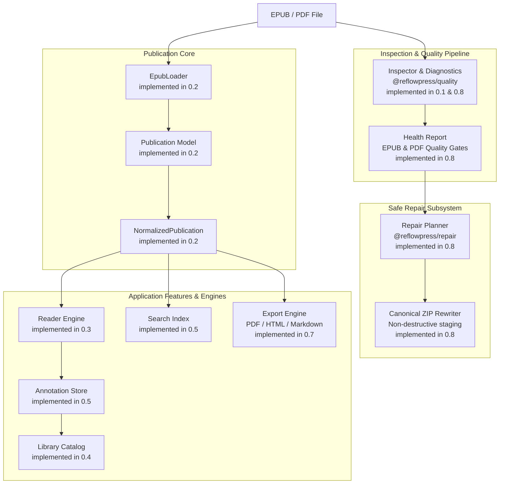
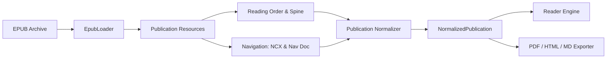
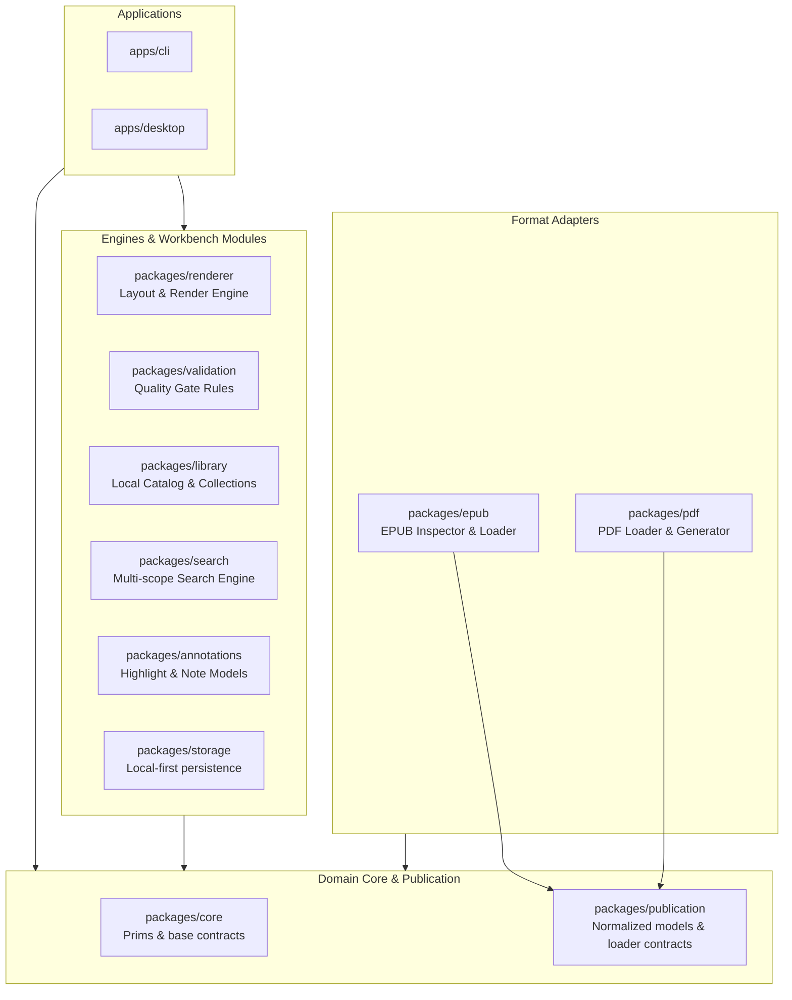
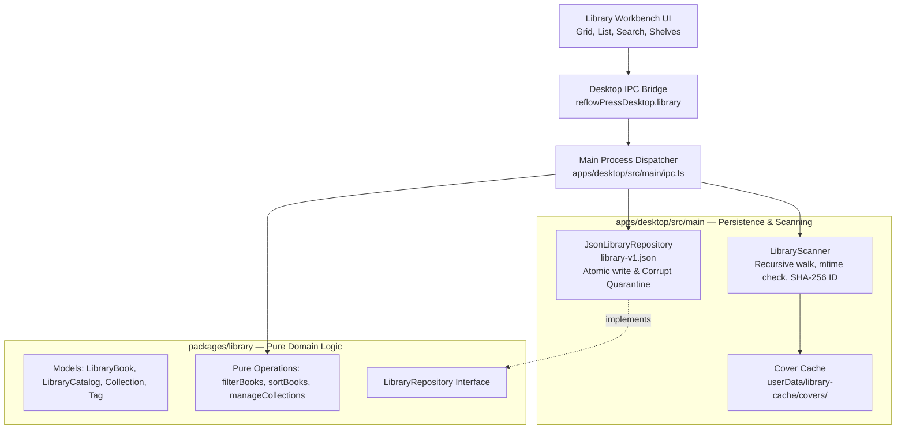
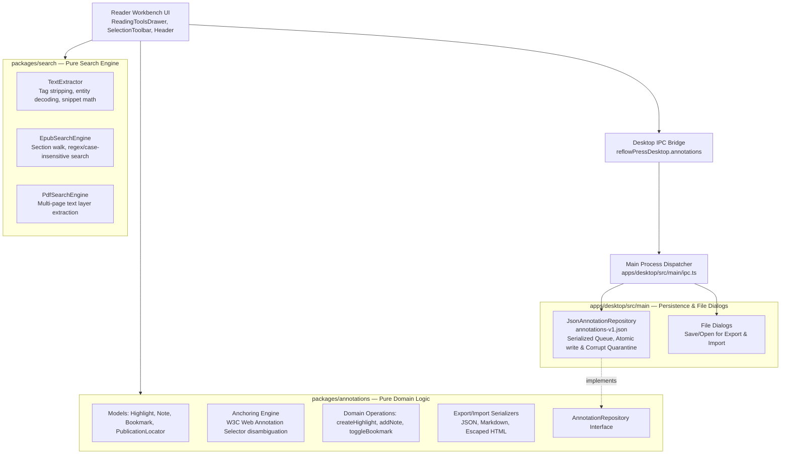
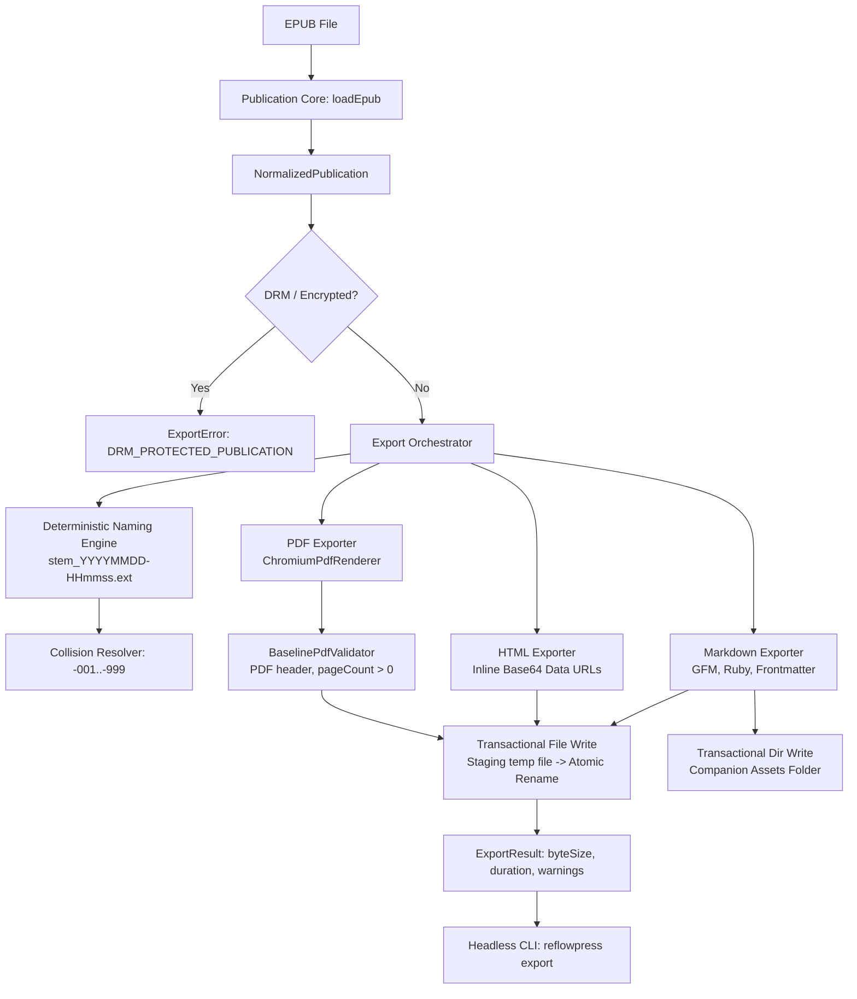
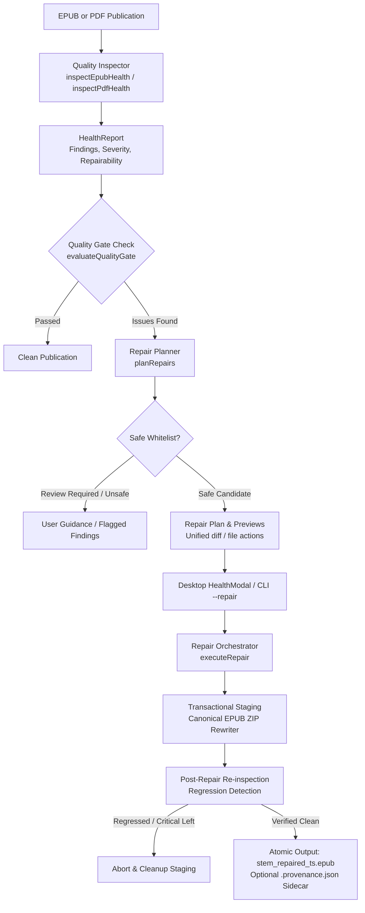

# Architecture v2: Electronic Publication Workbench

This document describes the system architecture for ReflowPress as a free, local-first electronic document workbench.

ReflowPress builds upon the foundational contracts established in Phase 1, expanding them to power both active document reading and high-fidelity document transformation without duplicating publication parsers.

---

## Architecture v2 Overview



### Component Responsibilities

1. **Inspector**: Performs fast, safe structural checks directly on the container archive without extracting full content. Produces the `Health Report`.
2. **Health Report**: Diagnostic details on container validity, package integrity, broken references, missing assets, and typography caveats.
3. **Loader (`EpubLoader`)**: Securely reads archive contents, decrypts standard non-DRM resources (e.g. font deobfuscation if applicable), and extracts publication assets into memory/streams.
4. **NormalizedPublication**: The format-neutral, canonical representation of a book, including its reading order, navigation hierarchy, metadata, and asset map.
5. **Reader**: Coordinates layout, visual paging, typography settings, and user interaction for reflowable and fixed-layout media.
6. **Annotation & Library**: Manages user-generated reading markers (bookmarks, highlights, notes) and collection catalogs stored in local-first storage.
7. **Search Index**: Constructs indexed or runtime full-text search across chapters, publications, and annotations.
8. **Export Engine**: Converts the normalized publication into PDF (via CSS Paged Media rendering), clean HTML, or Markdown.
9. **Validation Gate**: Asserts that generated outputs meet strict quality requirements before being marked as successful.

---

## Publication Core

A foundational principle of Architecture v2 is:

> **The Reader and the Exporter share one Publication Core.**
> An EPUB reader and a PDF export engine must not implement separate, diverging EPUB parsers.

### The Unified Publication Pipeline



### Milestone 0.2 Implementation: Enhanced `NormalizedPublication` Contract

In Milestone 0.2, the publication model was enhanced in `@reflowpress/core` without breaking backward compatibility:

```ts
export interface NavigationItem {
  readonly id?: string;
  readonly label: string;
  readonly href: string;
  readonly children?: readonly NavigationItem[];
}

export interface PublicationMetadata {
  readonly title?: string;
  readonly language?: string;
  readonly identifier?: string;
  readonly creator?: string | readonly string[];
  readonly publisher?: string;
  readonly description?: string;
  readonly rights?: string;
  readonly modified?: string;
  readonly renditionLayout?: "reflowable" | "pre-paginated";
  readonly renditionOrientation?: "auto" | "portrait" | "landscape";
  readonly renditionSpread?: "auto" | "none" | "landscape" | "both";
  readonly direction?: "ltr" | "rtl" | "default";
}

export interface PublicationSection {
  readonly id: string;
  readonly href: string;
  readonly mediaType: string;
  readonly markup: string;
  readonly linear?: boolean;
}

export interface NormalizedPublication {
  readonly version?: "2.0" | "3.0" | string;
  readonly metadata: PublicationMetadata;
  readonly readingOrder: readonly PublicationSection[];
  readonly resources: readonly PublicationResource[];
  readonly navigation?: readonly NavigationItem[];
}
```

### Shared Parsing Primitives (One Parser Path)

`packages/epub` avoids duplicating archive reading and XML/OPF parsing across `inspectEpub` and `EpubLoader`. The shared primitives are:

- `archive.ts`: Streaming ZIP archive access via `yauzl`, CRC32 validation, entry name safety checks, and strict byte limits.
- `xml.ts`: Non-DTD XML document parsing with `@xmldom/xmldom` and direct element traversal helpers.
- `path.ts`: Pure archive-relative path resolution with directory traversal prevention.
- `package-document.ts`: Unified OPF parsing for EPUB 2/3 metadata, manifest item resolution, spine reading order, and navigation document references.
- `navigation.ts`: Unified normalization of EPUB 3 Navigation Document (`<nav epub:type="toc">`) and EPUB 2 NCX (`<navMap> <navPoint>`).

---

## Package Architecture Proposal

### Current Package Structure (Milestone 0.8)

```text
packages/
  core/        - Shared format-neutral publication contracts
  epub/        - EPUB Inspector, EPUB 2/3 Loader, navigation normalization
  library/     - Local library domain, scanning, search, collections
  annotations/ - W3C Web Annotation locators, notes, bookmarks, PKM export/import
  search/      - In-book full-text search engine (EPUB and PDF)
  typography/  - Standards-based typography, writing mode resolution, TCY transform
  reader/      - Reader state, navigation stepping, user settings
  export/      - Publication export engine (PDF via Chromium, HTML, Markdown)
  quality/     - Structured diagnostics, resource graph, EPUB/PDF quality gates
  repair/      - Non-destructive safe repair planner, canonical ZIP rewriter, provenance
  pdf/         - PDF output contract types
  renderer/    - Renderer interface contracts
  validation/  - Validation interface contracts
apps/
  desktop/     - Electron 33 + React 19 + Vite desktop workbench application
  cli/         - Headless CLI entry point (export, inspect, validate, repair)
```

### Future Package Architecture Proposal

As ReflowPress grows toward Milestone 1.0, responsibilities will be partitioned into focused, single-purpose packages to avoid turning `core` into an unwieldy monolith:



### Proposed Package Responsibilities

- `@reflowpress/core`: Primitive types, error classification, common utilities, and system abstractions. Kept ultra-light.
- `@reflowpress/publication`: Definition of `NormalizedPublication`, section hierarchies, resource trees, and loader abstractions.
- `@reflowpress/epub`: EPUB Inspector, EPUB 2/3 Loader, resource unpacker, and safe repair mechanics.
- `@reflowpress/pdf`: PDF document abstraction, PDF rendering target, and PDF parser.
- `@reflowpress/renderer`: Presentation engine abstractions, CSS layout processing, pagination math.
- `@reflowpress/validation`: Rules engine for EPUB diagnostic checks and PDF Quality Gate assertions.
- `@reflowpress/library`: SQLite/file-based book indexing, cover generation, collections, and shelf queries.
- `@reflowpress/search`: Inverted index and streaming search across publications and notes.
- `@reflowpress/annotations`: Highlight anchoring (EPUB CFI / text selectors), notes, bookmark models, and export serializers.
- `@reflowpress/storage`: Local filesystem abstraction, atomic file writing, backup rotation, and platform-specific path helpers.

_Note: These packages represent an architectural roadmap. They will be introduced incrementally according to the milestone schedule rather than created prematurely._

---

## Desktop Architecture (Milestone 0.3)

In Milestone 0.3, ReflowPress implemented its desktop reader runtime as defined in [ADR 0003: Desktop Reader Runtime](adr/0003-desktop-reader-runtime.md). The desktop application maintains strict architectural boundaries across three layers:

```mermaid
flowchart TD
    subgraph SHELL[Desktop Shell: apps/desktop]
        MAIN[Electron Main Process<br/>Window lifecycle, safe IPC, atomic storage]
        PRELOAD[Preload Script<br/>contextIsolation, allowlisted bridge]
        RENDERER[React 19 + Vite Renderer<br/>Header, TOC Drawer, Footer, Settings]
    end

    subgraph ADAPTER[Application Adapter]
        BRIDGE[Desktop Bridge: reflowPressDesktop]
        SANITIZER[XHTML Sanitizer & Blob Resource Manager]
    end

    subgraph WORKBENCH[Pure Shared Domain Packages]
        READER_PKG[@reflowpress/reader<br/>State, Navigation, Settings, Location]
        CORE_PKG[@reflowpress/core<br/>NormalizedPublication, Section, Resource]
        EPUB_PKG[@reflowpress/epub<br/>loadEpub, inspectEpub]
    end

    MAIN --> PRELOAD
    PRELOAD --> BRIDGE
    BRIDGE --> RENDERER
    RENDERER --> SANITIZER
    RENDERER --> READER_PKG
    MAIN --> EPUB_PKG
    MAIN --> CORE_PKG
```

### Key Architectural Characteristics

1. **Security & Sandbox Isolation**:
   - `contextIsolation = true`, `nodeIntegration = false`, and `sandbox = true`.
   - The React renderer process has zero access to Node `fs`, `child_process`, or internal system handles.
   - All IPC communication is strictly typed and allowlisted via `contextBridge.exposeInMainWorld("reflowPressDesktop", ...)`.
   - Unauthorized external navigation and popup window creation are unconditionally blocked.

2. **UI-Independent Reader Domain (`@reflowpress/reader`)**:
   - Encapsulates pure domain logic: reading positions, navigation clamping, section href lookups, reader settings, and status state machines.
   - 100% free of Electron or React dependencies, ensuring complete portability for future CLI, web, or mobile runtimes.

3. **Multi-Format Publication Viewing**:
   - **Reflowable EPUB**: Rendered inside a sandboxed `<iframe>` (`sandbox="allow-same-origin"`, script execution blocked). XHTML is pre-sanitized by removing dangerous tags (`<script>`, `<object>`, `<embed>`), stripping inline event handlers (`onclick`, etc.), and neutralizing `javascript:` URLs. Publication assets (CSS, images, fonts) are served via mapped Blob URLs with disposal upon book unload.
   - **Native PDF**: Rendered directly onto an HTML5 `<canvas>` using Mozilla `pdfjs-dist` with page navigation and zoom controls (50% to 300%). The reader UI theme surrounds the canvas without inverting PDF page pixels.

4. **Atomic Reading Position Persistence**:
   - `ReadingPositionStore` persists active reading positions (section href, progress percentage, PDF page, zoom) to a localized JSON file (`reader-state.json`).
   - Uses write-to-temp-file and atomic rename semantics to prevent corruption during unexpected shutdowns. Restores position automatically upon reopening.

---

## Library Subsystem & Catalog Persistence (Milestone 0.4)

Milestone 0.4 integrates a local-first publication catalog into the desktop workbench, enabling multi-book management, fast search, custom collections, and cover extraction.



### Architectural Key Decisions & Safeguards:

1. **Versioned Atomic JSON Persistence (`library-v1.json`)**:
   - Implemented via `JsonLibraryRepository` adhering to the `LibraryRepository` domain interface.
   - Durability guaranteed by writing to `.tmp-<timestamp>`, syncing to disk via `fsync`, and executing an atomic rename.
   - **Corrupt Quarantine**: Malformed or unreadable catalogs are automatically backed up to `.corrupt-<timestamp>` and a fresh valid catalog (`schemaVersion: 1`) is initialized with warnings.

2. **Recursive Scanner & Incremental Indexing**:
   - `LibraryScanner` walks local directory trees finding `.epub` and `.pdf` files.
   - Computes deterministic SHA-256 IDs based on normalized canonical file paths.
   - Records `fileSizeBytes` and `modifiedTimeMs`. Re-scans compare disk stats and skip re-parsing unchanged books, guaranteeing high scan performance on large directories.

3. **Safe Cover Extraction & Caching**:
   - Extracts EPUB cover images from archive resources and caches them to `userData/library-cache/covers/<id>.<ext>`.
   - Desktop bridge exposes `readCoverImage` returning base64 data URIs, preserving complete Electron renderer sandbox isolation (`sandbox: true`, `nodeIntegration: false`).

4. **Multi-Criteria Filtering & Organization**:
   - Multi-field search across title, author, publisher, and tags.
   - Format filtering (`all`, `epub`, `pdf`), custom user shelves/collections, and sorting (recently added, title, author, last opened).
   - Seamless bidirectional transition between Library catalog and Reader MVP.
   - Full rationale documented in [ADR 0004: Library Persistence Architecture](adr/0004-library-persistence.md).

---

## Reading Tools Subsystem & Annotation Architecture (Milestone 0.5)

Milestone 0.5 evolves ReflowPress into an active reading workbench by introducing in-book full-text search, persistent bookmarks, multi-color text highlights, margin notes, and portable export/import capabilities.



### Architectural Key Decisions & Safeguards:

1. **W3C Web Annotation Compliant Hybrid Locators (`PublicationLocator`)**:
   - Anchoring relies on a composite locator rather than fragile single-strategy offsets or brittle DOM XPaths:
     - **EPUB**: Combines `sectionHref` + `TextQuoteSelector` (`exact`, `prefix`, `suffix`) + `TextPositionSelector` (`start`, `end`).
     - **PDF**: Combines `page` (1-based index) + `TextQuoteSelector` + optional bounding rects.
   - Robust against font resizing, reader window resizing, theme changes, and minor publisher markup updates.
   - Disambiguation engine uses surrounding prefix/suffix context to match the exact intended text occurrence even when repeated words occur within the same chapter.

2. **Pure Search Engine (`@reflowpress/search`)**:
   - `TextExtractor` removes markup elements (`<script>`, `<style>`, XML comments), decodes character and numeric entities, and builds unified plain-text layers.
   - Produces localized snippet previews with exact character boundaries and surrogate-pair safety.
   - Decoupled from renderer UI and desktop IPC, enabling headless CLI or worker thread execution.

3. **Versioned Atomic Annotation Storage (`annotations-v1.json`)**:
   - `JsonAnnotationRepository` guarantees crash-safety using a serialized promise queue, write-to-temp-file (`.tmp-<timestamp>`), `fsync`, and atomic rename.
   - **Corrupt Quarantine**: Invalid or unparseable JSON files are automatically quarantined to `.corrupt-<timestamp>` with warnings, safeguarding user data from silent overwrites.
   - **Version Guard**: Prevents older software from overwriting newer future schema versions.

4. **Portable Knowledge Management (PKM) Export & Import**:
   - **Markdown**: Clean, human-readable export with publication metadata, blockquotes, notes, bookmarks, and timestamps.
   - **HTML**: Standalone, styled document with zero external dependencies and full XSS-safe attribute/text escaping.
   - **JSON**: Complete structured serialization enabling backup, tool migration, and bi-directional import with duplicate deduplication and ID-conflict remapping.
   - Source publications (EPUB/PDF) are **never** modified or mutated.
   - Full rationale documented in [ADR 0005: Annotation Locators, Selectors, and Storage Architecture](adr/0005-annotation-locators-and-storage.md).

---

## Japanese Typography & Accessibility Architecture (Milestone 0.6)

Milestone 0.6 introduces first-class Japanese typography and a comprehensive WCAG 2.2 Level AA accessibility baseline as defined in [ADR 0006: Japanese Typography and Accessibility Architecture](adr/0006-japanese-typography-and-accessibility.md).

```mermaid
flowchart TD
    subgraph TYPO_PKG[@reflowpress/typography — Pure Domain]
        MODELS[Typography Models<br/>WritingMode, ReadingFlow, TypographyProfile]
        RESOLVER[flow.ts<br/>resolveWritingMode & resolveReadingFlow]
        CSS_GEN[css-generator.ts<br/>generateTypographyCss & normalizeLegacyEpubCss]
        TCY[tcy-transform.ts<br/>applyTcyAssist & removeTcySpans]
    end

    subgraph REUSE[Cross-Milestone Consumers]
        READER_UI[Reader UI (Milestone 0.6)<br/>EpubViewer, Axis-aware Nav, Settings]
        EXPORT_ENG[Export Engine (Milestone 0.7)<br/>EPUB to PDF / HTML with CSS Paged Media]
    end

    subgraph ACCESSIBILITY[WCAG 2.2 AA Accessibility Baseline]
        KEYBOARD[Keyboard Nav & Focus Trap<br/>Tab loop, Escape dismiss, Focus restore]
        LIVE_REGION[Polite ARIA Live Region<br/>Screen reader status announcements]
        CONTRAST[Accessible Themes<br/>High contrast, forced-colors, reduced-motion]
        AXE_AUDIT[Automated Axe-Core Auditing<br/>Continuous a11y regression scans]
    end

    MODELS --> RESOLVER --> CSS_GEN
    RESOLVER --> READER_UI
    CSS_GEN --> READER_UI
    TCY --> READER_UI
    CSS_GEN --> EXPORT_ENG
    MODELS --> EXPORT_ENG

    READER_UI --> ACCESSIBILITY
```

### Architectural Key Decisions & Safeguards:

1. **Chromium Standards-Based Typography**:
   - Rather than rolling an ad-hoc custom typesetting engine, ReflowPress relies on Chromium's native implementation of CSS Writing Modes Level 3 (`writing-mode: vertical-rl`), CSS Text Level 3 (`line-break: strict;`, `word-break: normal;`), and HTML5 `<ruby>`, `<rt>`, and `<rp>`.
   - Legacy EPUB-specific prefixes (`-epub-writing-mode`, `-epub-text-combine`, `-epub-line-break`) are safely and idempotently normalized to standard CSS properties.

2. **Pure Domain Package Separation (`@reflowpress/typography`)**:
   - Typography rules, CSS generation, reading progression resolution, and numeral transforms are housed entirely within `@reflowpress/typography` without DOM, React, or Electron dependencies.
   - This ensures identical typography rendering rules will be reused in Milestone 0.7 (Export Workbench to PDF/HTML) without duplicating styling logic.

3. **Author Styles First with User Override**:
   - Default `writingMode: "auto"` inspects EPUB OPF spine metadata (`page-progression-direction="rtl"`) and CSS declarations to preserve the publisher's intended layout.
   - Users can explicitly override layout to `horizontal-tb` or `vertical-rl` in Reader Settings at any time.

4. **Non-destructive Tate-chu-yoko (TCY) Numeral Alignment**:
   - In vertical text, 1–2 digit numbers are aligned horizontally (`text-combine-upright: all`).
   - The auto-assist transform (`applyTcyAssist()`) wraps 1–2 digit ASCII numbers in `<span class="reflowpress-tcy">` without altering underlying textContent, ensuring zero disruption to W3C `TextQuoteSelector` anchoring, search indexing, or user text selections.

5. **Axis-Aware Navigation**:
   - In `vertical-rl` mode, reading columns advance to the left (`scrollBy({ left: -step })`).
   - Arrow and Page keys adapt dynamically (`ArrowLeft` navigates forward in vertical-rl, backward in horizontal-tb; `PageDown` and `Space` always advance reading progression).

6. **WCAG 2.2 AA Accessibility Baseline**:
   - **Keyboard Navigation**: All interactive elements are reachable and operable via keyboard with prominent, accessible focus rings.
   - **Dialog Focus Management**: `SettingsModal` enforces a strict Tab focus trap, initial focus placement, Escape dismissal, and focus restoration to the originating control.
   - **Screen Reader Announcements**: A polite `aria-live` region announces page shifts, chapter transitions, search results, and setting updates without interrupting active speech synthesizers.
   - **Automated Regression Audits**: Playwright E2E tests incorporate `@axe-core/playwright` scanning across Library, Reader, Settings, and Reading Tools to guarantee 0 critical or serious accessibility violations.

## Milestone 0.7: Export Workbench Architecture

Milestone 0.7 introduces the **Export Workbench** subsystem, comprising `@reflowpress/export` and `@reflowpress/cli`:



### Architectural Key Decisions & Safeguards:

1. **Reusing Publication Core & Typography**:
   - The export pipeline consumes `NormalizedPublication` directly from `loadEpub()`—no separate EPUB parser was introduced.
   - Japanese layout rules and TCY styling from `@reflowpress/typography` are injected into both PDF and HTML outputs identically to Reader rendering.

2. **Headless Playwright Chromium for PDF Export ([ADR 0007](adr/0007-export-rendering-pipeline.md))**:
   - High-fidelity PDF rendering with full support for modern CSS Writing Modes (`vertical-rl`), native `<ruby>`, kinsoku line breaking, and CSS Paged Media `@page` sizing.
   - Strictly offline: all network traffic (`**`) is blocked via Playwright route aborting; scripts are disabled (`javaScriptEnabled: false`).

3. **Deterministic Filename Policy & Collision Handling**:
   - Default output pattern: `<source-stem>_<YYYYMMDD-HHmmss>.<ext>`.
   - Japanese characters in filenames are strictly preserved while filesystem-illegal characters are safely sanitized.
   - When a target exists (e.g. repeated exports within the same second), `-001` through `-999` suffixes are assigned deterministically without overwriting user data unless `--overwrite` is specified.

4. **Transactional Atomic Writes**:
   - Output files and companion asset folders are staged in unique hidden temporary locations before atomic rename into the destination directory. Partial, truncated, or interrupted files are never left in the user's workspace.

---

## Milestone 0.8: Quality & Safe Repair Architecture

Milestone 0.8 transforms ReflowPress into a Publication Quality & Repair Workbench, introducing `@reflowpress/quality` and `@reflowpress/repair` as defined in [ADR 0008: Quality and Safe Repair](adr/0008-quality-and-safe-repair.md):



### Architectural Key Decisions & Safeguards:

1. **Separation of Diagnostics and Mutations**:
   - `@reflowpress/quality` is strictly read-only and pure inspection. It produces factual, reproducible `QualityFinding` objects with location, evidence, severity (`fatal`, `error`, `warning`, `info`), and repairability classifications (`safe-auto`, `review-required`, `manual-only`, `none`).
   - `@reflowpress/repair` is the mutation orchestrator, operating exclusively on verified health reports and safe repair actions.

2. **Conservative Safe Repair Whitelist**:
   - Only unambiguous, low-risk defects are automatically planned:
     - Missing or corrupted `mimetype` file (reconstructed with canonical `application/epub+zip` at byte offset 38, uncompressed).
     - Missing `<container>` entry (rebuilt pointing to detected rootfile).
     - Standard manifest `media-type` mismatches.
     - Stray OS metadata (`.DS_Store`, `Thumbs.db`).
   - High-risk operations (deleting unreferenced resources, inventing synthetic metadata, or stripping active DRM) are strictly excluded from automated repair.

3. **Canonical EPUB ZIP Rewriting**:
   - The canonical rewriter in `@reflowpress/repair` guarantees EPUB 3 / OCF compliance:
     - Entry 0 is `mimetype`, uncompressed (`STORE`), with zero extra fields.
     - Unmodified entries are copied verbatim with identical byte contents and compression.
     - Directory entries and zip metadata are normalized.

4. **Transactional Staging and Re-Inspection Gate**:
   - Output files are assembled in temporary staging paths (`.tmp-<timestamp>`).
   - Before finalizing, the staged archive is re-evaluated with `inspectEpubHealth`. If new errors are introduced or target issues remain unresolved, the operation aborts and staging is purged.
   - Original source files are **never** mutated in place. Repaired publications are written to `<stem>_repaired_<YYYYMMDD-HHmmss>.epub`.
   - An optional `.provenance.json` sidecar records applied rules, source/target hashes, and re-inspection deltas.

5. **Integrated Verification in Desktop and CLI**:
   - **Desktop UI**: `HealthModal` provides an accessible, tabbed dialog with ARIA live announcements, visual and textual severity indicators, diff previews, and safe apply actions.
   - **Headless CLI**: `reflowpress inspect`, `reflowpress validate`, and `reflowpress repair` subcommands provide terminal-friendly Unix semantics and JSON outputs for automated pipelines.

---

## AI Policy & Integration Stance

1. **Non-Dependency**: AI is strictly optional. ReflowPress is completely usable, fast, and feature-complete in 100% offline, air-gapped environments without any AI components.
2. **Downstream Integration via Open Artifacts**: Rather than embedding complex proprietary LLM runtimes directly into the reading loop, ReflowPress empowers users to export clean, semantic artifacts (e.g. structured Markdown, sanitized text layers, JSON notes) that can be seamlessly consumed by external tools (ChatGPT, NotebookLM, local Ollama/Llama.cpp models, or personal PKM tools).
3. **User Consent & Privacy**: No document data or reading metadata will ever be transmitted to external AI endpoints without explicit, manual user initiation.

---

## Security and Privacy Design

- **Untrusted Input**: Electronic publications downloaded from the web are treated as untrusted bytecode/content.
- **Archive Traversal Prevention**: The ZIP extraction layer prohibits directory traversal (`../`) and enforces canonical relative paths within a virtual root.
- **Strict Network Isolation**: The reader and export engines reject remote HTTP/HTTPS resource loads by default to prevent IP tracking, telemetry beacons, and SSRF vulnerabilities.
- **Atomic, Non-destructive File Writes**: Document repairs, annotation saves, and export generation write to temporary files first and atomically rename upon completion. The original publication is never modified in place.
