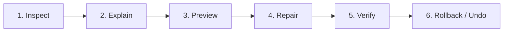

# ReflowPress Product Vision

## Product Definition

> **ReflowPress is a free, local-first workbench for reading, organizing, inspecting, repairing, searching, annotating, and exporting EPUB and PDF publications.**

_EPUB/PDFを読む・整理する・検索する・注釈する・検査する・修復する・変換するための、無料・ローカルファースト電子書籍ワークベンチ。_

ReflowPress redefines electronic document tooling by bridging reading, maintenance, and transformation into a unified, privacy-respecting workbench. Rather than treating conversion as an isolated, lossy black-box, ReflowPress treats electronic publications as structured digital artifacts that users own, inspect, read, refine, and repurpose on their own machines.

## Reference Product: Adobe Digital Editions (ADE)

Adobe Digital Editions 4.5.x serves as our functional benchmark for baseline reading, library management, and document navigation capabilities.

However, ReflowPress is **not** an Adobe clone:

- It does **not** copy or disassemble Adobe proprietary source code, internal binaries, UI assets, or trade secrets.
- It does **not** replicate Adobe ID authentication or Adobe proprietary cloud services.
- It strives for **functional parity in fundamental reading and cataloging**, paired with **substantial improvements** in publication health, safe repair, portable annotations, advanced search, and modern export workflows.

## Product Principles

1. **Free and open source**: ReflowPress is licensed openly and free to inspect, run, modify, and audit.
2. **Local-first**: Data, books, indexes, annotations, and configuration reside primarily on the user's local filesystem.
3. **Account optional**: No account creation, login, or cloud service registration is required to use any core feature.
4. **Standards-first**: Follow standard EPUB (EPUB 2/3), PDF (ISO 32000), HTML5, CSS, and Unicode specifications.
5. **No DRM circumvention**: We respect copyright and legal boundaries. ReflowPress does not break, circumvent, or strip DRM.
6. **Reader and converter share one Publication Core**: The EPUB reader and the export pipeline consume the exact same normalized publication model.
7. **Never silently corrupt a publication**: Malformed or unparseable input is explicitly reported. Source files are never modified without explicit consent.
8. **Inspect before repair**: Analysis and explanation always precede any modification.
9. **Non-destructive edits by default**: Repairs, annotations, and exports generate new files or isolated layers, preserving the untouched original.
10. **Automated repairs must be explainable and reversible**: Every correction is accompanied by a diff/explanation and can be undone.
11. **Quality is a product feature, not only a final test phase**: Built-in verification gates (EPUB Inspector, PDF Quality Gate) empower users to trust outputs.
12. **AI is optional; the product must be fully useful without AI**: The application operates with complete fidelity in fully offline, non-AI environments. AI integrations are purely additive downstream options.
13. **Privacy by default**: Zero unsolicited telemetry, zero silent network requests, and zero remote logging.
14. **Accessibility is a first-class requirement**: Keyboard navigation, screen-reader semantics, contrast ratios, and accessible typography are core design requirements.

## Product Boundaries

### In Scope (Long-term)

Centered on DRM-free EPUB and PDF publications:

- **Reading**: Reflowable & fixed-layout EPUB 2/3, PDF viewing, custom typography, font sizing, and color themes.
- **Japanese Typography**: Vertical writing (`writing-mode: vertical-rl`), ruby characters, kinsoku shori (line breaking rules), and tate-chu-yoko (TCY).
- **Library Management**: Local folder scanning, metadata indexing, cover extraction, custom collections/tags, and sorting/filtering.
- **Navigation**: Table of Contents (NCX and EPUB 3 Nav), spine sequence, landmarks, and page-list navigation.
- **Reading Tools**: Bookmarks, text highlights, margin notes, and persistent reading positions.
- **Search**: Scoped full-text search (current chapter, whole book, annotations, full library) with optional regular expressions.
- **Publication Health**: EPUB archive integrity, container validity, OPF package completeness, broken internal links, missing assets, and suspicious external references.
- **Safe Repair**: Explainable, previewable, non-destructive remediation of broken EPUB packages.
- **Export & Conversion**: EPUB to PDF, clean HTML, and structured Markdown export with deterministic timestamped naming.
- **PDF Validation**: Text layer verification, openability checks, image integrity, font embedding checks, and geometry assertions.
- **Automation**: Headless CLI for batch inspection, verification, and conversion.
- **Desktop Application**: Accessible, cross-platform GUI built on a modular desktop shell.
- **Portable Annotations**: Standards-compliant export and import of user annotations (JSON, Markdown, HTML).

### Explicit Non-Goals

ReflowPress will **never**:

- Crack, bypass, or circumvent digital rights management (DRM) schemes (e.g., Adobe Content Server DRM, FairPlay, Kindle DRM).
- Clone Adobe proprietary DRM algorithms or reverse-engineer ACSM token fulfillment mechanisms.
- Provide unauthorized or spoofed Adobe ID authentication hooks.
- Require cloud accounts or forced online sign-in to unlock functionality.
- Bundle unsolicited telemetry, analytics trackers, or phone-home beacons.
- Depend on external proprietary cloud AI APIs for core reader or workbench functions.

### Handling DRM-Protected Content

When encountering DRM-protected publications (such as EPUB archives containing `META-INF/rights.xml` or encrypted font/resource elements):

1. **Detect**: Identify standard encryption signatures safely without parsing encrypted payloads.
2. **Explain**: Inform the user clearly that the publication contains DRM protection.
3. **Handle Gracefully**: Classify as unsupported for inspection/repair/conversion without crashing or corrupting data.
4. **Handoff**: Provide clear guidance or system handoff to authorized, compliant software (such as an authorized reader).

## ReflowPress Differentiators

ReflowPress elevates document viewing into an active workbench with five key advantages:

### 1. Publication Health Inspection

Instead of failing cryptically when opening an invalid EPUB, ReflowPress features a dedicated diagnostic engine:

- Verifies archive integrity, `container.xml`, and OPF package structure.
- Checks manifest targets and verifies internal spine order.
- Detects missing assets (images, stylesheets, fonts) and broken internal hyperlinks.
- Flags suspicious remote HTTP/HTTPS resource references that compromise offline reading and privacy.
- Diagnoses typography issues (e.g., missing fallbacks or malformed ruby markup).
- Note: ReflowPress deliberately avoids arbitrary single "health scores" in favor of factual, actionable diagnostic reports.

### 2. Explainable, Safe Repair

Broken or aging EPUB files are repaired through a disciplined, non-destructive workflow:

- **Inspect**: Discover structural defects.
- **Explain**: Present the root cause in human-readable terms.
- **Preview**: Show a dry-run diff of proposed changes.
- **Repair**: Write corrections to a new target file; never overwrite original media in place without explicit instruction.
- **Verify**: Re-run the Inspector to ensure the repaired artifact passes standard checks.
- **Rollback**: Retain backups to guarantee immediate undoability.

### 3. Portable Annotations

Highlights, notes, and bookmarks belong to the reader, not the application database:

- Annotations can be exported to standard JSON, clean Markdown, or HTML.
- Exports are formatted cleanly for personal knowledge management (PKM) systems such as Obsidian, Logseq, Notion, or simple local archives.

### 4. Comprehensive Search Architecture

Search extends beyond simple keyword matching:

- Multi-tier search scope:
  - Current chapter
  - Current publication
  - User annotations and highlights
  - Book metadata
  - Entire personal library
- Advanced option: RegEx search support for power users and researchers.

### 5. Export Workbench & Quality Gate

Reading and conversion share the same structural understanding:

- High-fidelity export to PDF, clean HTML, and Markdown.
- Batch processing support via the headless CLI.
- Integrated **PDF Quality Gate** checking text extractability, font embedding, image presence, and geometry.
- Deterministic, collision-safe timestamped output naming (`{title}_{YYYYMMDD-HHmmss}.pdf`).

## Security and Privacy Principles

- **Untrusted Input**: All incoming EPUB and PDF files are treated as untrusted data.
- **Path Traversal Protection**: Archive extraction and path resolution reject `..` segments and absolute root paths.
- **Strict Network Isolation**: Parsing, inspecting, and rendering operate strictly offline. Remote resource resolution is disabled by default to prevent IP tracking and SSRF attacks.
- **No Telemetry**: No analytics, heartbeat pings, or usage diagnostics are transmitted across the network.
- **Safe Temporary Files**: Any temporary scratch directories are strictly isolated and deleted upon task completion.
- **Non-destructive Modification**: The original source document is treated as immutable by default.
