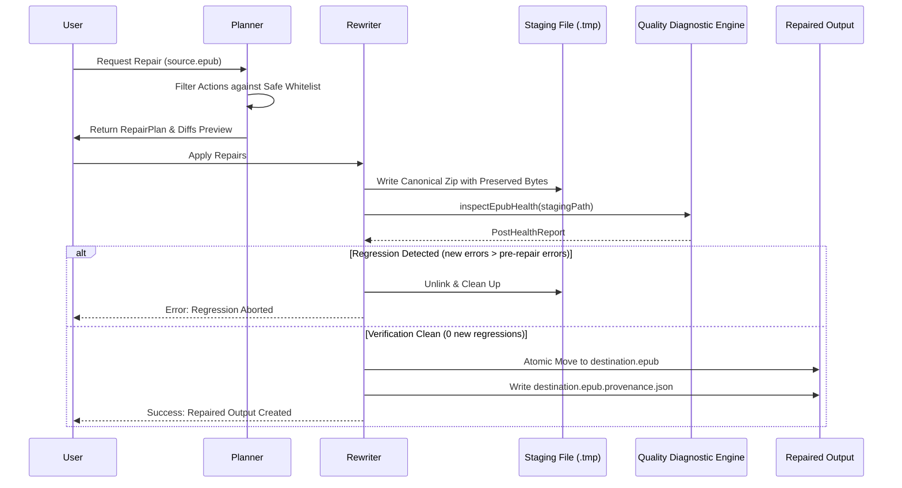

# ReflowPress Safe Repair Policy

This document defines the safety guarantees, repair whitelist, review boundaries, and verification protocol governing the `@reflowpress/repair` safe repair engine.

---

## 1. Core Principles of Safe Repair

ReflowPress adheres strictly to the JSTQB and local-first software preservation principles:

1. **Explicit, Never Silent**: ReflowPress **never silently repairs** a publication on open or import. All diagnostics must be presented first, allowing the user to inspect findings, view planned actions, and inspect before/after diffs.
2. **Strictly Non-Destructive**: The original source publication is **never overwritten or mutated in place**. Repaired output is written to a distinct file named `<stem>_repaired_<YYYYMMDD-HHmmss>.epub` (or a user-specified output directory).
3. **Byte Preservation Principle**: Archive entries that are not explicitly targeted by a repair action are preserved bit-for-bit. ReflowPress does not decompress, recompress, re-encode, or pretty-print untouched HTML/CSS/image files.
4. **Re-Inspection Verification**: Before any repaired file is committed to disk, it is re-inspected by the diagnostic engine. If the repaired publication exhibits any new `fatal` or `error` findings that were not present in the original, the operation is immediately aborted and all temporary files are unlinked.

---

## 2. Safe Repair Whitelist

Only issues with **mathematically and syntactically unambiguous resolutions** are whitelisted for automatic safe repair:

| Action               | Target Rules                                                           | Precondition                                                                         | Behavior                                                                                                                   |
| :------------------- | :--------------------------------------------------------------------- | :----------------------------------------------------------------------------------- | :------------------------------------------------------------------------------------------------------------------------- |
| `canonical-mimetype` | `EPUB-CONTAINER-001`<br/>`EPUB-CONTAINER-002`<br/>`EPUB-CONTAINER-003` | EPUB archive is readable                                                             | Places `mimetype` as entry 0 at byte offset 38, uncompressed (STORE), containing exact ASCII bytes `application/epub+zip`. |
| `container-xml`      | `EPUB-CONTAINER-004`                                                   | Single OPF package document detected in archive                                      | Synthesizes a standard `META-INF/container.xml` pointing to the detected OPF package document.                             |
| `manifest-mediatype` | `EPUB-MANIFEST-004`                                                    | Item extension is one of: `.xhtml`, `.html`, `.css`, `.png`, `.jpg`, `.jpeg`, `.svg` | Updates the OPF XML manifest declaration to the unambiguous standard MIME type matching the extension.                     |

---

## 3. Forbidden Automatic Actions (Review / Manual Only)

The following actions are **strictly forbidden** from automatic remediation:

1. **Auto-Deletion of Orphan Files**:
   - Files existing in the archive that are not in the manifest or unreferenced by chapters are classified as `EPUB-RESOURCE-001` (`review-required`).
   - ReflowPress **never deletes** orphan files automatically. They may represent author illustrations, research notes, or supplementary materials intended for human review.
2. **Synthetic Metadata Fabrication**:
   - Missing book titles (`EPUB-META-001`), authors, or identifiers are **never auto-generated** from file names or hashes. Synthetic metadata pollutes user libraries and invalidates citation integrity.
3. **Lossy HTML/CSS Re-encoding**:
   - ReflowPress does not execute destructive tag stripping or automated HTML cleaning that might alter author layout or typography.

---

## 4. Verification & Transactional Protocol

Every repair operation follows an atomic state machine:



---

## 5. Provenance Manifest

When executed with `--provenance` (or via Desktop workbench), ReflowPress outputs a `.provenance.json` sidecar alongside the repaired file:

```json
{
  "toolVersion": "0.1.0",
  "timestamp": "2026-10-03T09:00:00.000Z",
  "sourceSha256": "3a7b...",
  "outputSha256": "9f1c...",
  "appliedRuleIds": ["EPUB-CONTAINER-002", "EPUB-MANIFEST-004"]
}
```
