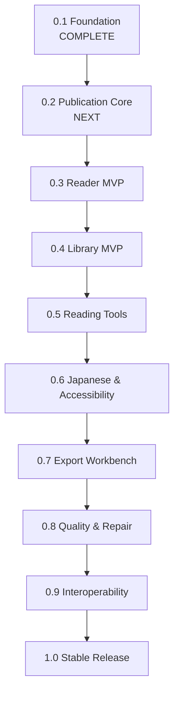

# ReflowPress Roadmap v2

This roadmap organizes the development of ReflowPress around milestones. It shifts the primary trajectory from an isolated "EPUB-to-PDF converter" into a **free, local-first ebook workbench**.

A key strategic principle of Roadmap v2 is:

> **Build the Publication Core before building converters or advanced readers.**
> A single, robust publication model must understand and normalize book content, structure, and navigation before reader rendering and export engines consume it.

---

## Milestone Overview

---

## Milestone Details

### Milestone 0.1: Foundation

- **Status**: **Complete**
- **Focus**: Repository bootstrap, workspace structure, contracts, CI, and Phase 1 EPUB Inspector.
- **Deliverables**:
  - TypeScript monorepo with pnpm workspace and strict typing.
  - Initial contract definitions: `NormalizedPublication`, `PublicationAdapter`, `Renderer`, `PdfValidator`.
  - Phase 1 EPUB Inspector: ZIP central directory inspection, `container.xml` parsing, OPF metadata/manifest/spine parsing, path traversal checks, resource size/count limits.
  - Automated test suite (22 unit tests) with 100% pass rate.
  - CI verification workflow.

---

### Milestone 0.2: Publication Core

- **Status**: **Next Priority**
- **Goal**: _ReflowPress understands the full content and structure of a publication._
- **Scope**:
  - `EpubLoader`: Load and extract publication resources securely from valid EPUB archives.
  - Document spine ordering and chapter hierarchy mapping.
  - Navigation parsing: EPUB 3 Navigation Document (`nav.xhtml`) and EPUB 2 NCX (`toc.ncx`) normalization.
  - Resource resolution: internal asset URLs (images, stylesheets, fonts, XHTML documents).
  - Normalization pipeline: map parsed EPUB resources into an enriched `NormalizedPublication` model.
  - EPUB 2 and EPUB 3 compatibility foundation.
  - Comprehensive unit and integration test fixtures for publication loading.
- **Exit Criteria**: `loadPublication(path)` loads any compliant, DRM-free EPUB 2/3 file and outputs a fully structured, memory-safe publication object ready for both readers and exporters.

---

### Milestone 0.3: Reader MVP

- **Status**: Planned
- **Goal**: _Users can read books._
- **Scope**:
  - EPUB rendering engine integration (DOM-based reflowable content layout).
  - PDF document viewing engine integration.
  - Interactive Table of Contents (TOC) drawer.
  - Chapter and page-by-page navigation (mouse, touch, keyboard).
  - Basic reading settings: font family, font size, line spacing, margins.
  - Color themes: light, dark, sepia.
  - Reading position persistence (last page/location remembered across sessions).

---

### Milestone 0.4: Library MVP

- **Status**: Planned
- **Goal**: _Users can organize their digital library._
- **Scope**:
  - Local directory scanning and book importing.
  - Cover extraction and thumbnail caching.
  - Metadata indexing (title, author, publisher, series, language, tags).
  - User collections, custom shelves, and tag management.
  - Sorting (by title, author, date added, recent reading) and instant filtering.
  - Local database persistence (embedded SQLite or JSON-based local catalog).

---

### Milestone 0.5: Reading Tools

- **Status**: Planned
- **Goal**: _ReflowPress serves as an everyday personal reading environment._
- **Scope**:
  - In-book full-text search with keyword highlighting and snippet previews.
  - Bookmarks with jump-to-location functionality.
  - Text selection highlights with multi-color support.
  - Margin notes and commentary attached to highlighted ranges.
  - Search across all personal annotations and highlights.
  - **Portable Annotations**: Export highlights and notes to JSON, clean Markdown, and HTML for personal knowledge management (PKM).

---

### Milestone 0.6: Japanese Typography & Accessibility

- **Status**: Planned
- **Goal**: _World-class Japanese document support and comprehensive accessibility._
- **Scope**:
  - Vertical text layout support (`writing-mode: vertical-rl`) with vertical paging.
  - Ruby annotations rendering (`<ruby>`, `<rt>`, `<rp>`) across horizontal and vertical modes.
  - Japanese line-breaking rules (Kinsoku shori: prohibiting line-initial/line-terminal symbols).
  - Tate-chu-yoko (horizontal-in-vertical text for digits/acronyms).
  - Comprehensive keyboard navigation shortcuts for all reader interactions.
  - Screen reader semantics, ARIA attributes, and accessible contrast ratios.
  - Right-to-Left (RTL) reading order planning (Arabic, Hebrew).
  - MathML rendering support evaluation.

---

### Milestone 0.7: Export Workbench

- **Status**: Planned
- **Goal**: _Transform publications into beautiful, reusable documents._
- **Scope**:
  - EPUB to PDF conversion engine utilizing CSS Paged Media.
  - Structured naming convention: preservation of source stem + conversion timestamp (`{title}_{YYYYMMDD-HHmmss}.pdf`) with second-collision handling.
  - EPUB to clean, standalone HTML export.
  - EPUB to Markdown export (preserving headings, images, and reading order).
  - Headless CLI interface (`reflowpress export ...`) for batch operations.

---

### Milestone 0.8: Quality & Repair

- **Status**: Planned
- **Goal**: _Unmatched publication health diagnostics, automated repair, and PDF QA._
- **Scope**:
  - Full **EPUB Health Diagnostic Suite**: broken manifests, orphaned files, missing assets, remote asset warnings, malformed OPF elements.
  - **Safe Repair Workflow**: Inspect → Explain → Preview → Non-destructive Repair → Verify → Undo.
  - **PDF Quality Gate**: Automated programmatic checks for PDF openability, extractable text layer integrity, embedded fonts, image presence, and page geometry.
  - Visual regression testing framework for layout engines.
  - Golden master testing pipeline for regression safety.

---

### Milestone 0.9: Interoperability

- **Status**: Planned
- **Goal**: _Seamless data portability across reading hardware and services._
- **Scope**:
  - OPDS catalog feed support (local catalog server and remote client).
  - E-reader device transfer support (USB/MTP synchronization).
  - Library backup and cross-device sync via user-owned cloud drives (Syncthing, Dropbox, WebDAV).
  - Audio/Video media overlays evaluation.

---

### Milestone 1.0: Stable Release

- **Status**: Planned
- **Goal**: _Production-grade stability, security, and distribution._
- **Scope**:
  - Official platform installers and auto-update mechanisms (macOS, Windows, Linux).
  - Crash recovery and automatic workspace state restoration.
  - Rigorous performance benchmarks (opening 1,000+ book libraries in < 1 second).
  - Full accessibility audit and certification.
  - Complete user manuals and developer API documentation.
  - API stability and backward compatibility guarantees for `NormalizedPublication` and plugins.
