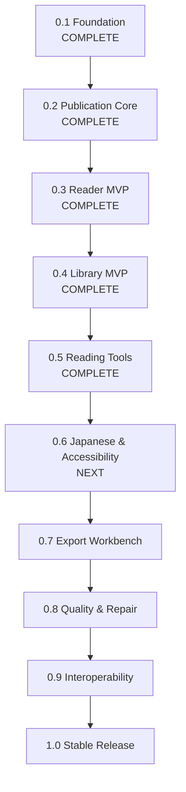

# ReflowPress Roadmap v2

This roadmap organizes the development of ReflowPress around milestones. It shifts the primary trajectory from an isolated "EPUB-to-PDF converter" into a **free, local-first ebook workbench**.

A key strategic principle of Roadmap v2 is:

> **Build the Publication Core before building converters or advanced readers.**
> A single, robust publication model must understand and normalize book content, structure, and navigation before reader rendering and export engines consume it.

---

## Milestone Overview

---

## Milestone Details

### Milestone 0.1: Foundation

- **Status**: **Complete**
- **Focus**: Repository bootstrap, workspace structure, contracts, CI, and Phase 1 EPUB Inspector.
- **Deliverables**:
  - TypeScript monorepo with pnpm workspace and strict typing.
  - Initial contract definitions: `NormalizedPublication`, `PublicationAdapter`, `Renderer`, `PdfValidator`.
  - Phase 1 EPUB Inspector: ZIP central directory inspection, `container.xml` parsing, OPF metadata/manifest/spine parsing, path traversal checks, resource size/count limits.
  - Automated test suite (22 unit tests) with 100% pass rate.
  - CI verification workflow.

---

### Milestone 0.2: Publication Core

- **Status**: **Complete**
- **Goal**: _ReflowPress understands the full content and structure of a publication._
- **Deliverables**:
  - `EpubLoader` & `loadEpub`: Securely load publication resources from valid EPUB archives.
  - Shared archive and XML primitives eliminating duplicate parsers.
  - Spine reading order preservation with linear flag mapping.
  - Unified navigation normalization for EPUB 3 Navigation Document (`nav.xhtml`) and EPUB 2 NCX (`toc.ncx`).
  - Safe XHTML content extraction with XML well-formedness and DTD defense.
  - Auxiliary resources loading (CSS, images, fonts).
  - Enriched `NormalizedPublication` and `PublicationMetadata` contracts.
  - Configurable resource bounds and DRM/encryption detection.
  - 14 new automated unit tests (36 unit tests total).

---

### Milestone 0.3: Reader MVP

- **Status**: **Complete**
- **Goal**: _Users can read local EPUB and PDF books with navigation, custom styling, and reading position restore._
- **Deliverables**:
  - `@reflowpress/reader`: UI-independent reader state modeling, navigation pure functions, reader settings, and position data structures.
  - `@reflowpress/desktop`: Desktop application shell powered by Electron 33, React 19, Vite, and PDF.js.
  - Secure sandboxed EPUB rendering (`sandbox="allow-same-origin"`, script execution blocked).
  - XHTML sanitization stripping dangerous tags (`<script>`, `<object>`, `<embed>`), inline event attributes, and `javascript:` URLs.
  - Resource mapping with automatic Blob URL generation and cleanup for stylesheets, fonts, and images.
  - Native PDF rendering using `pdfjs-dist` on HTML5 `<canvas>` with zoom controls (fit, zoom in/out) and page stepping.
  - Slide-over Table of Contents drawer with hierarchical navigation jumping.
  - Typography and themes: Light, Dark, Sepia, font size increment/decrement, typeface selection, and line spacing.
  - Atomic local reading position persistence (`reader-state.json`) with automatic restoration across restarts.
  - Architectural documentation: [ADR 0003: Desktop Reader Runtime](adr/0003-desktop-reader-runtime.md).
  - Comprehensive automated test suite: 57 unit tests + 5 Playwright desktop E2E tests (100% pass rate).

---

### Milestone 0.4: Library MVP

- **Status**: **Complete**
- **Goal**: _Users can organize their digital library with local-first persistence, collections, and fast search._
- **Deliverables**:
  - `@reflowpress/library`: UI-independent catalog modeling, pure filtering and sorting operations, tag normalization, collection management, and `LibraryRepository` contract.
  - Versioned atomic JSON catalog persistence (`library-v1.json`) with temporary write, `fsync`, atomic rename, and quarantine recovery for corrupted files (`.corrupt-<timestamp>`).
  - Recursive local directory scanner with incremental scanning (skipping unchanged files based on size and mtimeMs) and stable SHA-256 book identity.
  - Automated EPUB cover extraction and caching into `userData/library-cache/covers/` with sandboxed data URI bridge.
  - Desktop Workbench UI: Library view with responsive Grid and List layouts, multi-field search (title, author, publisher, tags), format categories (EPUB, PDF), custom shelves/collections, and direct reader launch.
  - Seamless navigation between Library view and Reader MVP via "← Library" and "Resume Reading" header actions.
  - Architectural documentation: [ADR 0004: Library Persistence Architecture and Repository Abstraction](adr/0004-library-persistence.md).
  - Automated test suite: 72 unit tests + 10 Playwright desktop E2E tests (100% pass rate).

---

### Milestone 0.5: Reading Tools

- **Status**: **Complete**
- **Goal**: _ReflowPress serves as an everyday personal reading environment with precision search, annotations, and notes._
- **Deliverables**:
  - `@reflowpress/annotations`: Pure domain package defining W3C Web Annotation-compliant hybrid locators, highlights, notes, bookmarks, and operations.
  - `@reflowpress/search`: Pure domain package providing streaming in-book full-text search with HTML tag stripping, entity decoding, context snippet extraction, and PDF multi-page extraction.
  - W3C Web Annotation hybrid selector anchoring: combines `sectionHref` + `TextQuoteSelector` (`exact`, `prefix`, `suffix`) + `TextPositionSelector` (`start`, `end`) for robust highlight re-anchoring across reflow.
  - Multi-color highlights (yellow, green, blue, pink) with floating selection toolbar and DOM `<mark class="reflowpress-highlight">` injection.
  - Bookmarks with jump-to-location functionality and keyboard shortcut (`Ctrl+D`).
  - Margin notes and commentary attached to highlighted ranges with in-drawer editing.
  - In-book full-text search with keyword highlighting, snippet previews, search result jump navigation, and keyboard shortcut (`Ctrl+F`).
  - Annotation search across all notes, bookmarks, and highlights.
  - Versioned atomic JSON persistence (`annotations-v1.json`) with corrupt file quarantine (`.corrupt-<timestamp>`) and write serialization queue.
  - **Portable Annotations**: Export highlights and notes to JSON, clean Markdown, and standalone escaped HTML for personal knowledge management (PKM), plus JSON import with merge conflict handling.
  - Architectural documentation: [ADR 0005: Annotation Locators, Selectors, and Storage Architecture](adr/0005-annotation-locators-and-storage.md).
  - Automated test suite: 104 unit tests + 15 Playwright desktop E2E tests (100% pass rate).

---

### Milestone 0.6: Japanese Typography & Accessibility

- **Status**: **Next Priority**
- **Goal**: _World-class Japanese document support and comprehensive accessibility._
- **Scope**:
  - Vertical text layout support (`writing-mode: vertical-rl`) with vertical paging.
  - Ruby annotations rendering (`<ruby>`, `<rt>`, `<rp>`) across horizontal and vertical modes.
  - Japanese line-breaking rules (Kinsoku shori: prohibiting line-initial/line-terminal symbols).
  - Tate-chu-yoko (horizontal-in-vertical text for digits/acronyms).
  - Comprehensive keyboard navigation shortcuts for all reader interactions.
  - Screen reader semantics, ARIA attributes, and accessible contrast ratios.
  - Right-to-Left (RTL) reading order planning (Arabic, Hebrew).
  - MathML rendering support evaluation.

---

### Milestone 0.7: Export Workbench

- **Status**: Planned
- **Goal**: _Transform publications into beautiful, reusable documents._
- **Scope**:
  - EPUB to PDF conversion engine utilizing CSS Paged Media.
  - Structured naming convention: preservation of source stem + conversion timestamp (`{title}_{YYYYMMDD-HHmmss}.pdf`) with second-collision handling.
  - EPUB to clean, standalone HTML export.
  - EPUB to Markdown export (preserving headings, images, and reading order).
  - Headless CLI interface (`reflowpress export ...`) for batch operations.

---

### Milestone 0.8: Quality & Repair

- **Status**: Planned
- **Goal**: _Unmatched publication health diagnostics, automated repair, and PDF QA._
- **Scope**:
  - Full **EPUB Health Diagnostic Suite**: broken manifests, orphaned files, missing assets, remote asset warnings, malformed OPF elements.
  - **Safe Repair Workflow**: Inspect → Explain → Preview → Non-destructive Repair → Verify → Undo.
  - **PDF Quality Gate**: Automated programmatic checks for PDF openability, extractable text layer integrity, embedded fonts, image presence, and page geometry.
  - Visual regression testing framework for layout engines.
  - Golden master testing pipeline for regression safety.

---

### Milestone 0.9: Interoperability

- **Status**: Planned
- **Goal**: _Seamless data portability across reading hardware and services._
- **Scope**:
  - OPDS catalog feed support (local catalog server and remote client).
  - E-reader device transfer support (USB/MTP synchronization).
  - Library backup and cross-device sync via user-owned cloud drives (Syncthing, Dropbox, WebDAV).
  - Audio/Video media overlays evaluation.

---

### Milestone 1.0: Stable Release

- **Status**: Planned
- **Goal**: _Production-grade stability, security, and distribution._
- **Scope**:
  - Official platform installers and auto-update mechanisms (macOS, Windows, Linux).
  - Crash recovery and automatic workspace state restoration.
  - Rigorous performance benchmarks (opening 1,000+ book libraries in < 1 second).
  - Full accessibility audit and certification.
  - Complete user manuals and developer API documentation.
  - API stability and backward compatibility guarantees for `NormalizedPublication` and plugins.
