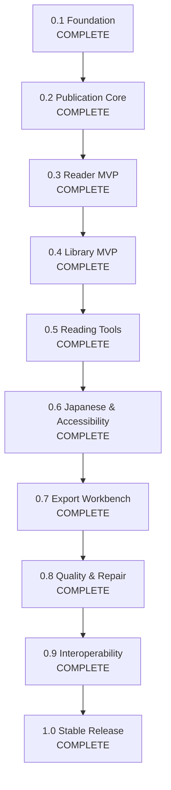

# ReflowPress Roadmap v2

This roadmap organizes the development of ReflowPress around milestones. It shifts the primary trajectory from an isolated "EPUB-to-PDF converter" into a **free, local-first ebook workbench**.

A key strategic principle of Roadmap v2 is:

> **Build the Publication Core before building converters or advanced readers.**
> A single, robust publication model must understand and normalize book content, structure, and navigation before reader rendering and export engines consume it.

---

## Milestone Overview

---

## Milestone Details

### Milestone 0.1: Foundation

- **Status**: **Complete**
- **Focus**: Repository bootstrap, workspace structure, contracts, CI, and Phase 1 EPUB Inspector.
- **Deliverables**:
  - TypeScript monorepo with pnpm workspace and strict typing.
  - Initial contract definitions: `NormalizedPublication`, `PublicationAdapter`, `Renderer`, `PdfValidator`.
  - Phase 1 EPUB Inspector: ZIP central directory inspection, `container.xml` parsing, OPF metadata/manifest/spine parsing, path traversal checks, resource size/count limits.
  - Automated test suite (22 unit tests) with 100% pass rate.
  - CI verification workflow.

---

### Milestone 0.2: Publication Core

- **Status**: **Complete**
- **Goal**: _ReflowPress understands the full content and structure of a publication._
- **Deliverables**:
  - `EpubLoader` & `loadEpub`: Securely load publication resources from valid EPUB archives.
  - Shared archive and XML primitives eliminating duplicate parsers.
  - Spine reading order preservation with linear flag mapping.
  - Unified navigation normalization for EPUB 3 Navigation Document (`nav.xhtml`) and EPUB 2 NCX (`toc.ncx`).
  - Safe XHTML content extraction with XML well-formedness and DTD defense.
  - Auxiliary resources loading (CSS, images, fonts).
  - Enriched `NormalizedPublication` and `PublicationMetadata` contracts.
  - Configurable resource bounds and DRM/encryption detection.
  - 14 new automated unit tests (36 unit tests total).

---

### Milestone 0.3: Reader MVP

- **Status**: **Complete**
- **Goal**: _Users can read local EPUB and PDF books with navigation, custom styling, and reading position restore._
- **Deliverables**:
  - `@reflowpress/reader`: UI-independent reader state modeling, navigation pure functions, reader settings, and position data structures.
  - `@reflowpress/desktop`: Desktop application shell powered by Electron 33, React 19, Vite, and PDF.js.
  - Secure sandboxed EPUB rendering (`sandbox="allow-same-origin"`, script execution blocked).
  - XHTML sanitization stripping dangerous tags (`<script>`, `<object>`, `<embed>`), inline event attributes, and `javascript:` URLs.
  - Resource mapping with automatic Blob URL generation and cleanup for stylesheets, fonts, and images.
  - Native PDF rendering using `pdfjs-dist` on HTML5 `<canvas>` with zoom controls (fit, zoom in/out) and page stepping.
  - Slide-over Table of Contents drawer with hierarchical navigation jumping.
  - Typography and themes: Light, Dark, Sepia, font size increment/decrement, typeface selection, and line spacing.
  - Atomic local reading position persistence (`reader-state.json`) with automatic restoration across restarts.
  - Architectural documentation: [ADR 0003: Desktop Reader Runtime](adr/0003-desktop-reader-runtime.md).
  - Comprehensive automated test suite: 57 unit tests + 5 Playwright desktop E2E tests (100% pass rate).

---

### Milestone 0.4: Library MVP

- **Status**: **Complete**
- **Goal**: _Users can organize their digital library with local-first persistence, collections, and fast search._
- **Deliverables**:
  - `@reflowpress/library`: UI-independent catalog modeling, pure filtering and sorting operations, tag normalization, collection management, and `LibraryRepository` contract.
  - Versioned atomic JSON catalog persistence (`library-v1.json`) with temporary write, `fsync`, atomic rename, and quarantine recovery for corrupted files (`.corrupt-<timestamp>`).
  - Recursive local directory scanner with incremental scanning (skipping unchanged files based on size and mtimeMs) and stable SHA-256 book identity.
  - Automated EPUB cover extraction and caching into `userData/library-cache/covers/` with sandboxed data URI bridge.
  - Desktop Workbench UI: Library view with responsive Grid and List layouts, multi-field search (title, author, publisher, tags), format categories (EPUB, PDF), custom shelves/collections, and direct reader launch.
  - Seamless navigation between Library view and Reader MVP via "← Library" and "Resume Reading" header actions.
  - Architectural documentation: [ADR 0004: Library Persistence Architecture and Repository Abstraction](adr/0004-library-persistence.md).
  - Automated test suite: 72 unit tests + 10 Playwright desktop E2E tests (100% pass rate).

---

### Milestone 0.5: Reading Tools

- **Status**: **Complete**
- **Goal**: _ReflowPress serves as an everyday personal reading environment with precision search, annotations, and notes._
- **Deliverables**:
  - `@reflowpress/annotations`: Pure domain package defining W3C Web Annotation-compliant hybrid locators, highlights, notes, bookmarks, and operations.
  - `@reflowpress/search`: Pure domain package providing streaming in-book full-text search with HTML tag stripping, entity decoding, context snippet extraction, and PDF multi-page extraction.
  - W3C Web Annotation hybrid selector anchoring: combines `sectionHref` + `TextQuoteSelector` (`exact`, `prefix`, `suffix`) + `TextPositionSelector` (`start`, `end`) for robust highlight re-anchoring across reflow.
  - Multi-color highlights (yellow, green, blue, pink) with floating selection toolbar and DOM `<mark class="reflowpress-highlight">` injection.
  - Bookmarks with jump-to-location functionality and keyboard shortcut (`Ctrl+D`).
  - Margin notes and commentary attached to highlighted ranges with in-drawer editing.
  - In-book full-text search with keyword highlighting, snippet previews, search result jump navigation, and keyboard shortcut (`Ctrl+F`).
  - Annotation search across all notes, bookmarks, and highlights.
  - Versioned atomic JSON persistence (`annotations-v1.json`) with corrupt file quarantine (`.corrupt-<timestamp>`) and write serialization queue.
  - **Portable Annotations**: Export highlights and notes to JSON, clean Markdown, and standalone escaped HTML for personal knowledge management (PKM), plus JSON import with merge conflict handling.
  - Architectural documentation: [ADR 0005: Annotation Locators, Selectors, and Storage Architecture](adr/0005-annotation-locators-and-storage.md).
  - Automated test suite: 104 unit tests + 15 Playwright desktop E2E tests (100% pass rate).

---

### Milestone 0.6: Japanese Typography & Accessibility

- **Status**: **Complete**
- **Goal**: _Natural Japanese vertical/horizontal ebook reading and baseline WCAG 2.2 AA accessibility._
- **Deliverables**:
  - `@reflowpress/typography`: Pure domain package providing typography models, reading flow resolution, writing mode normalization, strict kinsoku CSS generation, and non-destructive Tate-chu-yoko (TCY) text transformation.
  - Standards-based Chromium CSS Writing Modes (`vertical-rl`), CSS Text 3 line breaking (`line-break: strict;`), and word breaking (`word-break: normal;`).
  - Native `<ruby>`, `<rt>`, and `<rp>` rendering support across horizontal and vertical layouts.
  - Tate-chu-yoko (TCY) support: publisher-authored (`.tcy`, `-epub-text-combine`) and idempotent, non-destructive auto-assist wrapping 1–2 digit ASCII numbers in vertical text without altering textContent or invalidating W3C annotation offsets.
  - Writing-mode aware navigation: axis-aware keyboard controls (leftward column progression via `ArrowLeft`, `PageDown`, `Space`), horizontal stepping in vertical-rl layout, and dynamic reader settings (Auto/Author, Horizontal, Vertical).
  - Comprehensive keyboard accessibility: full Tab order, visible focus rings, dialog focus trap with Tab/Shift+Tab wrapping, Escape dismissal, and focus restoration to opener button.
  - Screen reader support: polite `aria-live` status announcements for page, chapter, search, and setting changes, ARIA dialog and drawer landmarks, valid `aria-controls` references, and descriptive `aria-label`s.
  - Automated accessibility auditing: `@axe-core/playwright` integration scanning Library, Reader, Settings modal, and Reading Tools drawer with 0 critical or serious violations.
  - Architectural documentation: [ADR 0006: Japanese Typography and Accessibility Architecture](adr/0006-japanese-typography-and-accessibility.md).
  - Automated test suite: 111 unit tests across 13 suites + 19 Playwright desktop E2E tests (100% pass rate).

---

### Milestone 0.7: Export Workbench

- **Status**: **Complete**
- **Goal**: _Transform publications into beautiful, reusable documents (PDF, HTML, Markdown) without duplicating parser logic._
- **Deliverables**:
  - `@reflowpress/export`: Domain export engine implementing PDF, standalone HTML, and Markdown conversions with transactional safety.
  - `@reflowpress/cli`: Headless CLI application (`reflowpress export`) for single-file and batch conversions with bounded concurrency.
  - High-fidelity EPUB to PDF conversion utilizing headless Playwright Chromium with strict offline network isolation, CSS Paged Media `@page` margins, page size selection (A4, A5, B5, Letter), and Japanese typography reuse (`vertical-rl`, kinsoku, ruby, TCY).
  - Deterministic timestamp naming policy: `<source-stem>_<YYYYMMDD-HHmmss>.<ext>` with injectable clock, Unicode Japanese character preservation in stems, and collision resolution (`-001` to `-999`).
  - Standalone HTML export: inlines publication resources as Base64 Data URLs, strips `<script>` tags and event handlers for security, and injects typography styles.
  - GitHub-Flavored Markdown (GFM) export: YAML frontmatter with metadata, ruby transliteration (`<ruby>基底<rt>ふりがな</rt></ruby>` -> `基底（ふりがな）`), MathML preservation with warning, table formatting, and companion asset directory map.
  - Transactional file and directory writing: stages outputs in temporary files/folders and atomically renames on completion to prevent partial output corruption.
  - Batch export runner with configurable worker parallelism (`--jobs <n>`), sorted inputs, cancellation via `AbortSignal`, and partial failure resilience.
  - Headless CLI with standard exit codes (0: success, 1: partial failure, 2: fatal error), `--json` structured reports, `--quiet`, `--recursive` folder scanning, and `--overwrite`.
  - Baseline PDF validation in `@reflowpress/validation` checking header signature (`%PDF-`), non-empty buffer, and positive page count.
  - Architectural documentation: [ADR 0007: Export Rendering Pipeline (Playwright Chromium Headless)](adr/0007-export-rendering-pipeline.md).
  - Automated test suite: 145 unit tests across 19 suites + 24 Playwright E2E tests (100% pass rate).

---

### Milestone 0.8: Quality & Repair

- **Status**: **Complete**
- **Goal**: _Transform ReflowPress into a publication QA workbench with structured diagnostics, evidence, preview-first safe repair, and automated output quality verification._
- **Deliverables**:
  - `@reflowpress/quality`: Pure TypeScript diagnostic rule engine for EPUB and PDF publications with zero external runtime dependencies.
  - Granular stable rule catalog (`EPUB-CONTAINER-*`, `EPUB-PACKAGE-*`, `EPUB-MANIFEST-*`, `EPUB-SPINE-*`, `EPUB-NAV-*`, `EPUB-RESOURCE-*`, `EPUB-META-*`, `EPUB-SEC-*`, `PDF-STRUCT-*`, `PDF-TEXT-*`, `PDF-GEOM-*`, `PDF-IMAGE-*`, `PDF-FONT-*`).
  - Full resource reference graph analysis identifying unmanifested orphan files and broken internal hyperlinks.
  - PDF Quality Gate evaluating openability, extractable text layers, scanned document detection, page geometry bounds, image presence, and font embedding boundary disclaimers against configurable profiles (`baseline`, `reader-export`).
  - `@reflowpress/repair`: Non-destructive safe repair engine writing to `<stem>_repaired_<timestamp>.epub`, strictly preserving untouched entries bit-for-bit.
  - Safe repair actions: uncompressed canonical `mimetype` restoration at offset 38, manifest media-type normalization, and standard `container.xml` creation.
  - Pre/post re-inspection verification aborting and cleaning up temporary staging files if regressions are introduced.
  - `.provenance.json` sidecar generation detailing source and output SHA-256 hashes and applied rule IDs.
  - Headless CLI subcommands: `reflowpress inspect`, `reflowpress validate`, and `reflowpress repair` (`--apply`).
  - Desktop Workbench Health & Safe Repair modal with WCAG 2.2 AA accessibility, ARIA live announcements, explicit textual severity badges, and preview diffs.
  - 3-Tier Golden Master Regression Framework (structural JSON, textual plain-text, and Playwright visual screenshot comparisons with `pnpm test:visual:update`).
  - Architectural documentation: [ADR 0008: Quality Diagnostic Engine, Safe Repair, and Output Quality Gate](adr/0008-quality-and-safe-repair.md), [Diagnostic Rule Catalog](quality-rules.md), [Safe Repair Policy](repair-policy.md).
  - Automated test suite: 167 unit tests across 23 suites + 26 Playwright E2E tests (100% pass rate).

---

### Milestone 0.9: Interoperability

- **Status**: **Complete**
- **Goal**: _Connect ReflowPress publications, library catalog, reading positions, annotations, and safe repairs with external devices, OPDS readers, physical e-readers, and sync targets without cloud lock-ins or privacy compromises._
- **Deliverables**:
  - `@reflowpress/opds`: Built-in OPDS 2.0 JSON Catalog generator, parser with OPDS 1.2 Atom XML fallback, HTTP loopback server (default `127.0.0.1`), RFC 9110 Range request support (`206/416`), opaque acquisition URIs.
  - `@reflowpress/sync`: Decentralized 3-way merge engine with zero silent data loss (`ConflictRecord`), deterministic machine-independent portable publication IDs, atomic sync bundle serializer/deserializer, shared folder adapter with lease lock recovery, WebDAV adapter (RFC 4918) with HTTPS enforcement and credential protection.
  - `@reflowpress/device`: Hardware e-reader detection (Amazon Kindle, Rakuten Kobo, PocketBook, Generic USB storage), transactional staging transfer with SHA-256 integrity, collision prevention, directory traversal containment, and explicit MTP capability boundary.
  - EPUB 3.3 Media Overlays: SMIL 3.0 audio-text synchronization parser (`parseClockValue`, `parseSmilDocument`) and audio reference inspection.
  - Headless CLI subcommands: `reflowpress opds`, `reflowpress sync`, `reflowpress backup`, `reflowpress restore`, and `reflowpress device`.
  - Desktop Workbench Interoperability Modal with WCAG 2.2 AA accessibility, ARIA live announcements, tabbed navigation across OPDS, Sync, Backup, and Device Transfer.
  - Comprehensive documentation: [ADR 0009: Interoperability, OPDS, and Data Portability](adr/0009-interoperability-and-sync.md), [OPDS Guide](opds.md), [Sync Guide](sync.md), [Device Transfer Guide](device-transfer.md), [Media Overlays Guide](media-overlays.md).
  - Automated test suite: 213 unit tests across 29 suites + 27 Playwright E2E tests (100% pass rate).

---

### Milestone 1.0: Stable Release

- **Status**: **Complete**
- **Goal**: _Production-grade stability, security, and distribution._
- **Deliverables**:
  - Official multi-platform packaging specification (`electron-builder.yml`) for macOS, Windows, and Linux.
  - Crash recovery protocol with `.clean-shutdown` and `.active-session.json` marker tracking, non-intrusive workspace recovery UI, and automatic cleanup of orphaned atomic `.tmp-*` files.
  - Synthetic 1,000-book performance benchmark (< 10ms read & query, well under 1,000ms budget).
  - Desktop renderer code-splitting with sub-500 kB application chunks and automated bundle size budget analysis (`pnpm analyze:bundle`).
  - Forward schema migration framework with `UpgradeRequiredError` and zero data loss on future schemas.
  - Public API contract freeze across all 16 `@reflowpress/*` packages with `pnpm test:api`.
  - Canonical versioning policy (`pnpm test:version`).
  - Production dependency audit with 0 high / 0 critical vulnerabilities.
  - Comprehensive documentation: [User Guide](user-guide.md), [Troubleshooting](troubleshooting.md), and [ADR 0010](adr/0010-stable-runtime-and-release.md).
