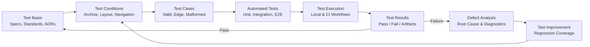
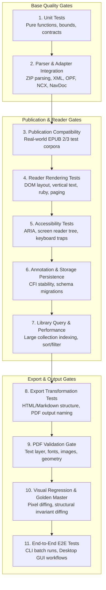

# Test Strategy v2: Electronic Publication Workbench

This document describes the quality assurance and test engineering strategy for ReflowPress. It is grounded in the vocabulary and principles of the JSTQB Foundation Level, adapting them to a local-first electronic document workbench.

---

## Test Philosophy: Quality as a Core Feature

In ReflowPress, quality is not a cosmetic sign-off phase at the end of a sprint; it is an active product capability exposed directly to users via the **EPUB Inspector**, the **Safe Repair engine**, and the **PDF Quality Gate**.

The test strategy balances lightweight, fast unit checks for rapid developer feedback with rigorous fixture-based verification for publication compatibility and visual rendering integrity.

---

## Test Design and Feedback Loop



---

## Multi-Layer Quality Framework

To safeguard ReflowPress as it evolves through Milestones 0.1 to 1.0, test verification is partitioned into targeted quality layers:



### Detailed Layer Breakdown

| Level / Layer                             | Scope and Focus                                                                                          | Current Status                                                                                                                                 | Target Milestone |
| ----------------------------------------- | -------------------------------------------------------------------------------------------------------- | ---------------------------------------------------------------------------------------------------------------------------------------------- | ---------------- |
| **1. Unit Tests**                         | Pure business logic, bounds checks, timestamp formatting, contract typing, catalog, annotations, export. | **Implemented (167 tests passing across 23 suites)**                                                                                           | 0.1 – 0.8        |
| **2. Parser & Adapter Integration**       | EPUB Inspector archive parsing, container/OPF extraction, path traversal rejection.                      | **Implemented (`tests/unit/epub-inspector.test.ts`)**                                                                                          | 0.1              |
| **3. Publication Compatibility**          | Validation of EPUB 2 and EPUB 3 loading, navigation normalization, content reading.                      | **Implemented (`tests/unit/epub-loader.test.ts`)**                                                                                             | 0.2              |
| **4. Reader Rendering & State**           | DOM layout verification, sandboxed iframe isolation, XHTML sanitization, canvas PDF rendering.           | **Implemented (`tests/unit/reader-domain.test.ts`, `tests/e2e/reader-desktop.spec.ts`)**                                                       | 0.3 & 0.6        |
| **5. Accessibility (a11y)**               | Keyboard navigation loops, focus order, ARIA attributes, contrast ratios, axe-core scans.                | **Implemented (`tests/e2e/japanese-accessibility-desktop.spec.ts`, `tests/e2e/health-desktop.spec.ts`)**                                       | 0.6 & 0.8        |
| **6. Storage & Catalog Persistence**      | Atomic JSON state files, corrupted state quarantine, position & annotation persistence across sessions.  | **Implemented (`tests/unit/desktop-storage.test.ts`, `tests/unit/library-persistence.test.ts`, `tests/unit/annotations-persistence.test.ts`)** | 0.3, 0.4 & 0.5   |
| **7. Library Scanning & Indexing**        | Recursive filesystem scan, incremental mtime/size checks, EPUB cover extraction, collection management.  | **Implemented (`tests/unit/library-domain.test.ts`, `tests/unit/library-scanner.test.ts`)**                                                    | 0.4              |
| **8. Export Transformation**              | EPUB to PDF/HTML/Markdown, deterministic timestamp naming, collision resolution, batch orchestration.    | **Implemented (`tests/unit/export-*.test.ts`, `tests/unit/cli.test.ts`)**                                                                      | 0.5 & 0.7        |
| **9. PDF Validation Gate**                | Automated checks verifying header signature (%PDF-), non-empty buffer, openability, page geometry.       | **Implemented (`@reflowpress/quality`, `BaselinePdfValidator`, `evaluateQualityGate`)**                                                        | 0.7 & 0.8        |
| **10. Visual Regression & Golden Master** | Headless browser rendering comparison against reviewed pixel baselines; invariant structural diffing.    | **Implemented (`tests/unit/golden-master.test.ts`, `tests/e2e/visual-regression.spec.ts`)**                                                    | 0.8              |
| **11. End-to-End (E2E)**                  | Desktop GUI flows (Playwright Electron) and Headless CLI batch execution.                                | **Implemented (`tests/e2e/*.spec.ts` - 26 passing across 7 suites)**                                                                           | 0.3 – 0.8        |

_Note: In adherence to our transparency principles, planned layers are not recorded as implemented until automated test suites exist and pass in CI._

---

## Applied Test Design Techniques

The test suite applies standard test design techniques across the Inspector, Loader, Reader, Library, Reading Tools, Export Workbench, and Quality & Repair pipelines:

| Technique                    | Applied Specification in ReflowPress                                                                                                           | Current Status                     |
| ---------------------------- | ---------------------------------------------------------------------------------------------------------------------------------------------- | ---------------------------------- |
| **Equivalence Partitioning** | Valid minimal EPUB 2/3, missing container/OPF/spine/nav, malformed XML, missing manifest files, text quote selectors, export formats.          | Implemented                        |
| **Boundary Value Analysis**  | Max archive bytes (128 MiB), max entries (20,000), metadata XML size (4 MiB), markup size (8 MiB), resource size (16 MiB), collision attempts. | Implemented                        |
| **Decision Table Testing**   | Permutations of archive state -> container presence -> OPF validity -> spine references -> NavDoc/NCX type -> normalized publication model.    | Implemented                        |
| **Error Guessing**           | Archive traversal (`../`), DTD entity expansion, absolute root paths, DRM encryption detection, corrupted JSON recovery, quarantined catalogs. | Implemented                        |
| **State Transition Testing** | Document progression: Discovered -> Inspected -> Normalized -> Rendered -> Exported -> Validated; Library <-> Reader <-> Annotations.          | Implemented in 0.3, 0.4, 0.5 & 0.7 |

---

## Test Suites in `tests/unit` (167 Tests Total Across 23 Suites)

1. **Contract Tests** (`tests/unit/contracts.test.ts`, 3 tests)
2. **EPUB Inspector Test Suite** (`tests/unit/epub-inspector.test.ts`, 19 tests)
3. **EPUB Publication Loader Test Suite** (`tests/unit/epub-loader.test.ts`, 14 tests)
4. **Reader Domain Test Suite** (`tests/unit/reader-domain.test.ts`, 14 tests)
5. **Desktop Storage Test Suite** (`tests/unit/desktop-storage.test.ts`, 7 tests)
6. **Library Domain Test Suite** (`tests/unit/library-domain.test.ts`, 7 tests)
7. **Library Persistence & Recovery Test Suite** (`tests/unit/library-persistence.test.ts`, 4 tests)
8. **Library Scanner Test Suite** (`tests/unit/library-scanner.test.ts`, 4 tests)
9. **Annotations Domain Test Suite** (`tests/unit/annotations-domain.test.ts`, 10 tests)
10. **Annotations Persistence & Recovery Test Suite** (`tests/unit/annotations-persistence.test.ts`, 5 tests)
11. **Annotations Export & Import Test Suite** (`tests/unit/annotations-export-import.test.ts`, 6 tests)
12. **In-Book Search Test Suite** (`tests/unit/search.test.ts`, 11 tests)
13. **Japanese Typography Test Suite** (`tests/unit/typography.test.ts`, 7 tests)
14. **Export Filename & Collision Test Suite** (`tests/unit/export-filename.test.ts`, 12 tests)
15. **HTML Exporter Test Suite** (`tests/unit/export-html.test.ts`, 4 tests)
16. **Markdown Exporter Test Suite** (`tests/unit/export-markdown.test.ts`, 5 tests)
17. **PDF Exporter Test Suite** (`tests/unit/export-pdf.test.ts`, 2 tests)
18. **Batch Exporter Test Suite** (`tests/unit/export-batch.test.ts`, 3 tests)
19. **CLI Integration Test Suite** (`tests/unit/cli.test.ts`, 8 tests)
20. **Quality Rules & Gate Test Suite** (`tests/unit/quality-rules.test.ts`, 11 tests)
21. **Repair Roundtrip & Provenance Test Suite** (`tests/unit/repair-roundtrip.test.ts`, 1 test)
22. **CLI Quality Subcommands Test Suite** (`tests/unit/cli-quality.test.ts`, 6 tests)
23. **Golden Master Structural & Textual Fidelity Test Suite** (`tests/unit/golden-master.test.ts`, 4 tests)

---

## Playwright E2E Suites (`tests/e2e`, 26 Tests Total Across 7 Suites)

1. **Reader MVP Desktop E2E** (`tests/e2e/reader-desktop.spec.ts`, 5 tests)
2. **Library MVP Desktop E2E** (`tests/e2e/library-desktop.spec.ts`, 5 tests)
3. **Reading Tools Desktop E2E** (`tests/e2e/reading-tools-desktop.spec.ts`, 5 tests)
4. **Japanese Typography & Accessibility Desktop E2E** (`tests/e2e/japanese-accessibility-desktop.spec.ts`, 4 tests)
5. **Headless Export CLI E2E** (`tests/e2e/export-cli.spec.ts`, 5 tests)
6. **Desktop Health & Safe Repair E2E** (`tests/e2e/health-desktop.spec.ts`, 1 test)
7. **Visual Regression E2E** (`tests/e2e/visual-regression.spec.ts`, 1 test)

---

## Continuous Integration & Regression Strategy

1. **Fast Local Feedback**: Every local commit should pass:
   ```sh
   pnpm lint
   pnpm typecheck
   pnpm test
   pnpm test:cli
   pnpm test:visual
   pnpm build
   pnpm test:e2e
   pnpm audit --prod
   ```
2. **CI Gates**:
   - `verify`: Runs on `ubuntu-latest` running lint, typecheck, vitest (167 tests), and build.
   - `desktop-e2e`: Runs on `ubuntu-latest` under `xvfb-run -a pnpm test:e2e` (26 tests) with automated failure artifact capture and axe-core accessibility regression scanning.
3. **Deterministic CI Pipeline**: GitHub Actions runs on `ubuntu-latest` with Node.js 22, verifying formatting, strict typing, unit tests, and workspace builds on every PR and push to `main`.
4. **Golden Master Stability**: Structural and textual invariants are verified in unit testing, while visual pixel stability is checked via Playwright visual snapshots under `test:visual`.
