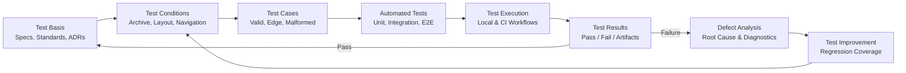
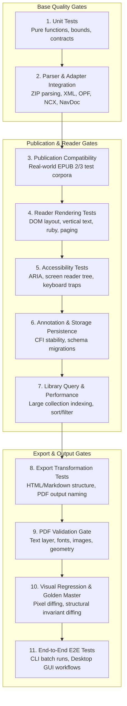

# Test Strategy v2: Electronic Publication Workbench

This document describes the quality assurance and test engineering strategy for ReflowPress. It is grounded in the vocabulary and principles of the JSTQB Foundation Level, adapting them to a local-first electronic document workbench.

---

## Test Philosophy: Quality as a Core Feature

In ReflowPress, quality is not a cosmetic sign-off phase at the end of a sprint; it is an active product capability exposed directly to users via the **EPUB Inspector**, the **Safe Repair engine**, and the **PDF Quality Gate**.

The test strategy balances lightweight, fast unit checks for rapid developer feedback with rigorous fixture-based verification for publication compatibility and visual rendering integrity.

---

## Test Design and Feedback Loop



---

## Multi-Layer Quality Framework

To safeguard ReflowPress as it evolves through Milestones 0.1 to 1.0, test verification is partitioned into targeted quality layers:



### Detailed Layer Breakdown

| Level / Layer                             | Scope and Focus                                                                                          | Current Status                                        | Target Milestone     |
| ----------------------------------------- | -------------------------------------------------------------------------------------------------------- | ----------------------------------------------------- | -------------------- |
| **1. Unit Tests**                         | Pure business logic, bounds checks, timestamp formatting, contract typing.                               | **Implemented (22 tests passing)**                    | 0.1                  |
| **2. Parser & Adapter Integration**       | EPUB Inspector archive parsing, container/OPF extraction, path traversal rejection.                      | **Implemented (`tests/unit/epub-inspector.test.ts`)** | 0.1                  |
| **3. Publication Compatibility**          | Validation of real-world EPUB 2 and EPUB 3 samples (IDPF / W3C test suites).                             | Planned                                               | 0.2                  |
| **4. Reader Rendering**                   | DOM layout verification, vertical Japanese flow, ruby positioning, chapter transitions.                  | Planned                                               | 0.3 & 0.6            |
| **5. Accessibility (a11y)**               | Keyboard navigation loops, focus order, ARIA attributes, contrast ratios.                                | Planned                                               | 0.6                  |
| **6. Annotation & Storage**               | Anchor stability against DOM variations, SQLite/JSON schema migrations, data durability.                 | Planned                                               | 0.4 & 0.5            |
| **7. Library Performance**                | Ingestion benchmarks (1,000+ files), search indexing throughput, query latency.                          | Planned                                               | 0.4 & 0.5            |
| **8. Export Transformation**              | Markdown/HTML structure preservation, metadata fidelity, collision-safe filename generation.             | Planned                                               | 0.7                  |
| **9. PDF Validation Gate**                | Automated checks verifying text extractability, embedded font subsetting, image dimensions, openability. | Planned                                               | 0.8                  |
| **10. Visual Regression & Golden Master** | Headless browser rendering comparison against reviewed pixel baselines; invariant structural diffing.    | Planned                                               | 0.8                  |
| **11. End-to-End (E2E)**                  | Full desktop GUI flows (Playwright) and headless CLI batch workflows.                                    | Configured / Planned                                  | 0.7 (CLI), 1.0 (GUI) |

_Note: In adherence to our transparency principles, planned layers are not recorded as implemented until automated test suites exist and pass in CI._

---

## Applied Test Design Techniques (Phase 1 Baseline)

The existing EPUB Inspector suite applies standard test design techniques to ensure resilient boundaries:

| Technique                    | Applied Specification in ReflowPress                                                                                                              | Current Status   |
| ---------------------------- | ------------------------------------------------------------------------------------------------------------------------------------------------- | ---------------- |
| **Equivalence Partitioning** | Valid minimal EPUB archives, corrupted ZIP binaries, absent container XML, malformed package XML, missing manifest files, missing spine items.    | Implemented      |
| **Boundary Value Analysis**  | Max archive byte limits (128 MiB), max entry counts (20,000 entries), max metadata XML document size (4 MiB), zero vs single spine items.         | Implemented      |
| **Decision Table Testing**   | Validating permutations of archive condition -> container presence -> OPF validity -> manifest target existence -> result / error classification. | Implemented      |
| **Error Guessing**           | Archive path traversal attacks (`../`), DTD entity expansion attacks, absolute root paths, Windows backslash vs Unix slash ambiguities.           | Implemented      |
| **State Transition Testing** | Document progression: Discovered -> Inspected -> Normalized -> Rendered -> Exported -> Validated.                                                 | Planned for 0.2+ |

---

## Existing EPUB Inspector Test Suite (`tests/unit`)

The 22 active tests exercise the following concrete input classes:

| Test Classification            | Test Input Conditions                                                        | Expected Error or Behavior                                           |
| ------------------------------ | ---------------------------------------------------------------------------- | -------------------------------------------------------------------- |
| `VALID_EPUB`                   | Well-formed minimal EPUB 3 archive with OPF, manifest, and spine             | Success: returns package path, metadata, manifest items, spine order |
| `VALID_OPTIONAL_ABSENT`        | Valid EPUB with optional metadata fields omitted                             | Success: returns undefined for missing scalars, empty creator array  |
| `INVALID_EPUB_ARCHIVE`         | Non-ZIP buffer or corrupted ZIP header bytes                                 | `INVALID_EPUB_ARCHIVE`                                               |
| `CONTAINER_XML_NOT_FOUND`      | Valid ZIP missing `META-INF/container.xml`                                   | `CONTAINER_XML_NOT_FOUND`                                            |
| `INVALID_CONTAINER_XML`        | Corrupted XML, missing rootfile element, or unsafe path in `container.xml`   | `INVALID_CONTAINER_XML`                                              |
| `PACKAGE_DOCUMENT_NOT_FOUND`   | `container.xml` points to OPF path not present in ZIP                        | `PACKAGE_DOCUMENT_NOT_FOUND`                                         |
| `INVALID_PACKAGE_DOCUMENT`     | Malformed XML, missing package/metadata/manifest/spine elements in OPF       | `INVALID_PACKAGE_DOCUMENT`                                           |
| `MANIFEST_REFERENCE_NOT_FOUND` | Item listed in manifest but corresponding file missing from ZIP              | `MANIFEST_REFERENCE_NOT_FOUND`                                       |
| `SECURITY_PATH_TRAVERSAL`      | ZIP entry name or package reference contains `../` escaping root             | Rejected with appropriate path safety error                          |
| `BOUNDS_EXCEEDED`              | Archive size, entry count, or metadata XML size exceeds configured threshold | Rejected with limits exceeded error                                  |

---

## Continuous Integration & Regression Strategy

1. **Fast Local Feedback**: Every local commit should pass:
   ```sh
   pnpm lint
   pnpm typecheck
   pnpm test
   pnpm build
   ```
2. **Deterministic CI Pipeline**: GitHub Actions runs on `ubuntu-latest` with Node.js 22, verifying formatting, strict typing, unit tests, and workspace builds on every PR and push to `main`.
3. **Golden Master Stability**: When golden master and visual regression suites are introduced in Milestone 0.8, raw byte comparisons will be avoided in favor of normalized structural comparisons to prevent false positives from timestamp or compression differences.
